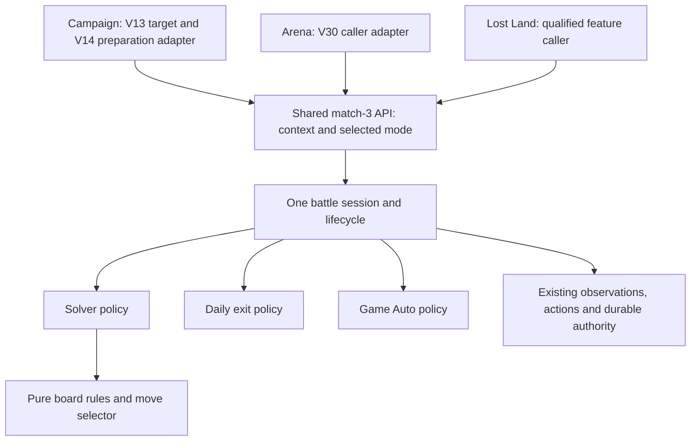

# Match-3 epic — shared component, solver and battle modes

**Status:** M0 implemented and reviewed, 2026-09-22. M1–M4 and live qualification remain pending. **Repository base:** `68cb9351c141b9467e3f2a6a54018b38df201d4c`. This plan is the canonical delivery owner for the shared API, pure solver and battle execution. The [solver design reference](PNC_MATCH3_BATTLE_SOLVER_PLAN.md) retains algorithm boundaries and rule evidence, with no separate S-series delivery track. The [battle behavior note](../../../docs/game-reference/workflows/match3-battles.md) records versioned evidence and unknowns.

## Outcome and delivery boundary

Campaign, Arena and Lost Land call one match-3 component and explicitly select one of three modes. Time Rift is deferred until its behavior is understood. All nine context/mode combinations are intended scope; they may be qualified incrementally, with unavailable combinations reported honestly.

| Mode | Behavior when implemented | Completion evidence |
|---|---|---|
| `solver` | Use our pure solver to try to win; execute one observed legal action at a time. Use visibly ready hero skills and ordinary valid target selection, then reobserve. | Independently recognized victory/defeat or explicit stopped/unknown outcome. No guaranteed win. |
| `daily_exit` | Use the earliest qualified Exit/retreat/skip path after an authorized entry. Distinguish skipping a presentation from forfeiting a battle. | Actual exit/result and safe return; the Daily caller separately verifies its exact quest row. Exit alone proves neither victory nor credit. |
| `game_auto` | Use the game's Auto only when unlocked. Leave it on if already on; otherwise toggle once, confirm and wait with bounds. | Observed Auto state and actual result, or explicit unavailable/stopped/unknown outcome. No unlock purchase or silent fallback. |

**First delivery is M0: selectable modes, typed API and explicit unavailable responses, with no implemented battle policies.** V13/V14 and V30 need M0 plus their own caller tests; M1–M4 and the solver are not their completion prerequisites. Visible choices mean documented/public request values and availability in the existing API/authored workflow surfaces, including any existing option help. This work does not require inventing a GUI or enabling unsupported execution.

## Consolidated milestones and dependencies

The former S1 board-rules and S2 combat-selection deliverables are part of M1. The former S3 runtime integration deliverable is part of M4. This changes delivery ownership, not the separation between pure algorithms and runtime code.

| Milestone | Deliverable and prerequisites |
|---|---|
| M0 | Shared contract and honest unavailable implementation; the only new match-3 prerequisite for V13/V14/V30 API handoffs. |
| M1 | Shared observations/authorized lifecycle, pure board rules and combat-aware selection. Lifecycle and pure rules can advance independently after their shared types have one owner; combat selection builds on those rules and available behavior evidence. |
| M2 | Daily-exit and game-Auto policies, each depending on the relevant M1 lifecycle/control evidence. Neither waits for the pure solver or its calibration. |
| M3 | Feature/Daily bindings against M0 and the qualified feature adapters. Operational use requires the relevant M1 lifecycle plus an implemented policy; solver requests remain unavailable until M4. |
| M4 | Integrate the M1 solver into the shared lifecycle, then qualify implemented context/mode combinations. Deterministic solver integration needs M1's lifecycle and a working pure selector; live caller proof additionally needs the relevant M3 binding and exact authorization. |

These are deliverable dependencies, not a requirement to finish every context or every M1 workstream before starting later work. Missing combat traces leave calibration explicitly pending; they do not block accepted rules/lifecycle work, Auto/Exit, API bindings or deterministic solver integration. M4 may provide authorized traces for M1's model calibration. Uncalibrated estimates remain labeled, and no mode is promoted without its own evidence. No live budget is expanded by this consolidation.

## Architecture and owners

Feature callers own target selection, qualified navigation/preparation and the eventual safe return. Daily owns quest mapping, pre/post progress, claims, scheduling and total budgets. The component owns entry authorization, active-battle observations/controls, policy dispatch and terminal evidence. Pure solver code never sees a runtime or GUI control.

Use a small PNC-domain contract and a constrained match-3 session adapter following existing `core_hero_hall_session.py` / `core_resource_item_session.py` patterns. Borrow the caller's runtime and lease; do not open another runner, connection or reservation. Do not insert a battle loop into legacy `CampaignTask`, generic task retries, the navigator or `CoreMutationBoundary`.

Keep the existing runner's routed completion for ordinary workflows. The nested component returns a verified result before the parent uses its qualified return route. If battle state is uncertain, stop through the existing error/stop path, preserve evidence and prevent the runner's normal automatic exit navigation; a successful return value must not hide unsafe battle state. An actual result may remain valid even if the later Home return fails. A global `WorkflowSpec` exit-policy migration is not an M0 or V dependency; introduce only a narrowly justified change if M1 execution proves the existing stop contract insufficient.

### Repository evidence informing the architecture

- At the planning base, `CampaignPolicy.from_params` reads `enabled_modes` and ignores unknown fields. Merely documenting `battle_mode` would silently discard it. The affected caller must parse/forward it explicitly and reject invalid values before connection; unknown match-3 request fields cannot silently become preparation success.
- `TaskRegistry` still registers legacy `CampaignTask`; Arena and Lost Land task IDs are not registered workflows at this base. V30 adds a thin feature adapter/API binding, not a fake completed Arena workflow. Preserve existing Campaign preparation calls while package 04 migrates their canonical dispatch.
- `CoreWorkflowRunner` navigates to its declared exit after successful `execute`; battle uncertainty must not return normal success. Existing mutation dispatch already journals before input, and connected Daily rejects unpromoted capabilities before connection. Reuse those owners instead of creating a parallel battle journal or promoting Daily from a mode declaration.
- There are no qualified active-board/result observations yet. V14 distinguishes actual Hero Formation from the older prep endpoint. M0 therefore needs no invented board screen, mutation capability, AP policy or live capture.

## M0 — Shared API contract and unavailable implementation

Define these semantics using existing naming/result conventions; names below describe the intended contract:

| Contract | Required meaning |
|---|---|
| `Match3Context` | `campaign`, `arena`, `lost_land`; no speculative Time Rift member. |
| `Match3Mode` | `solver`, `daily_exit`, `game_auto`, distinct from Standard/Elite difficulty and fixed-stage/progression policy. |
| Availability query | Pure preflight for a context/mode: available, not implemented or unsupported with a reason. Implementation availability is distinct from a later observed Auto lock or missing runtime evidence. Initially all nine combinations are not implemented. |
| Typed request | Exact context, selected mode and typed feature target/preparation reference. Do not duplicate existing Campaign stage/formation receipt schemas or invent unobserved target facts. Runtime execution also requires current identity and exact applicable authority; M0 grants neither. |
| Typed result | Unavailable reason or actual battle outcome plus stop reason and terminal evidence when implemented. Keep battle outcome separate from caller return status and Daily progress. No success, victory, quest completion or fabricated receipt for an unavailable request. |
| Execution API | One entry point taking the request and a borrowed constrained session. It validates availability again before actions; in M0 it returns typed `not_implemented` without accessing the runtime or sending input. |

Expose the three choices through the affected feature request models/help. For existing Campaign calls, omission retains preparation-only behavior and no match-3 execution call. An explicit battle request requires a valid mode; do not choose a default battle mode or reinterpret `enabled_modes`. Direct and authored inputs share the same parser. Check availability before opening a runtime or navigating for a battle request; an already connected caller also checks before new feature actions. Revalidate execution readiness at the shared boundary once modes become available.

Availability preflight needs only context/mode, not a selected stage or connected preparation receipt. Reuse existing typed target facts for the execution contract; define only any missing minimal receipt shape with the V14/V30 adapter owners and land it once in M0. Defining this type does not require their completed routes, package 04's migration or M1's battle observations. Actual runtime readiness remains an execution gate, so the dependency graph has no cycle.

Use one shared production API with a real unavailable implementation. Test substitution belongs at its declared interface using the real typed request/result models, not copied V-local enums or production dummy solver loops. An in-test available implementation can record an execution call; no runtime flag may force unfinished production modes available.

**M0 done:** tests prove all three mode values and contexts survive validation, invalid values fail, availability is honest, and real unavailable requests cannot connect, navigate, spend, retry or report success. Existing preparation-only behavior remains intact. Publish the contract revision so V adapters and pure solver work can proceed independently. No battle observations, spending integration, solver algorithm, exit automation or Auto waiting are required.

**M0 implementation checkpoint:** canonical types are in `pnc_automation/app/pnc/domain/match3.py`; the API and unavailable implementation are in `pnc_automation/app/automation/match3/`. `Match3Target` retains existing Campaign facts, `ScreenDecision`, `DetectedListEntry` and source `FrameRef`, validating supplied provenance without claiming runtime readiness. Campaign's direct/authored parser preserves the explicit mode and rejects invalid/unknown inputs. The engine checks component availability and its own execution binding before connection or feature actions: an available component alone cannot make legacy preparation satisfy a battle request. Package 04 replaces the binding refusal when it composes the V14 adapter. The V coordinator confirmed this reference shape meets the V14/V30 caller amendment; their adapter execution tests remain separately owned and pending.

Validation: 104 focused contract/caller tests and 22 architecture tests passed. The final portable run on `8207d06` passed 2,865 tests with seven skips across all 337 portable modules; evidence is `.test-impact/m0-integration-full-results.json` in the implementation worktree. An earlier full run had one mail archive concurrency failure; that test passed in this final run without persistence changes. After reconciling newer main's popup changes and consolidated plan, all 121 selected contract/caller/popup tests passed. No live action or resource spend was needed for M0.

## V13/V14/V30 handoff acceptance — depends only on M0

| Owner | Thin integration and definition of done |
|---|---|
| [V13](../vision/modules/V13_CAMPAIGN_MAP_AND_CHAPTERS.md) | Carry selected Campaign target and requested battle mode through the existing feature caller into the V14-owned adapter. Test that selection/context and each of the three modes reach that single adapter unchanged. No second battle call in map navigation or perception. Existing accepted vision coverage remains accepted; this is a pending additive caller amendment. |
| [V14](../vision/modules/V14_CAMPAIGN_STAGE_AND_FORMATION.md) | Own the single Campaign preparation-to-match-3 handoff. Use the genuine typed target/preparation contract; an offline recording API proves one execution call with context `campaign`, each selected mode and preserved source-stage provenance. Propagate the typed result; do not implement any policy. |
| [V30](../vision/modules/V30_ARENA_VERSUS_CENTER.md) | Bind the qualified Arena target/menu context and selected mode to the same API, once per explicit battle invocation. The adapter test uses an evidenced typed menu/target receipt without pretending active battle entry is qualified. It does not alias Arena to Hero Showdown. |

For each production feature adapter, test the real M0 unavailable path **before runtime creation/input**, then its execution handoff using a recording test implementation of the shared API. Import the real contract and test production parsing/composition, including typed result/error propagation and no retry/fallback. A test that only calls a mock directly is insufficient. The Campaign adapter test is shared by V13/V14; V13 additionally proves target/mode forwarding, rather than implementing or testing another battle entry. Preparation-only Campaign requests send zero execution calls.

These tests, plus each V packet's existing perception/navigation acceptance, finish the amended V scope. They establish integration readiness, not battle capability. No solver, Daily-exit, Auto implementation, battle start, quest credit or live combat proof is required. Existing nonspending live route proofs remain scoped to their packet; no new live run is needed solely for API wiring.

Package 04 consumes the V14 adapter when migrating public/authored Campaign callers. V14 exposes it beside the current consumer endpoint correction; it need not finish package 04's broader migration to test the adapter. Package 04 must not create a competing battle controller or make its preparation port wait for M1–M4.

## M1 — Shared foundations and pure solver

M1 owns the shared lifecycle plus the former S1/S2 algorithm work. Preserve separate production owners: observations/session/authority supply qualified state and execute actions; pure domain code implements rules and selection without screenshots, emulator handles, gestures or authority objects. Use immutable board, rule, combat-state, action and evaluation types. Context names must not silently choose dimensions, rule variants or combat models; share one engine with only evidenced differences. See the [solver design reference](PNC_MATCH3_BATTLE_SOLVER_PLAN.md) for packaged rule evidence and unresolved mechanics.

### Shared observations and authorized lifecycle

Add active, resolving/turn-blocked, victory, defeat and exited observations through one feature producer consumed by both existing publishers. Keep geometry/provenance in the observation/session layer. Demand only decision-critical facts for the selected mode: unreadable tiles block solver decisions, not an otherwise qualified Auto/Exit control and terminal observation. Qualify actual context/rules, Auto off/on/locked/unknown, owned Exit confirmation, continuation setting and safe result/return boundaries.

Compose qualified preparation with one battle-start action through existing exact-identity authority and durable mutation dispatch. Authorization binds castle, context, target, selected mode and observed applicable cost/attempt budget, including deliberate retreat. Extend the existing shared journal only for evidenced AP/Arena/Lost Land resource semantics; do not encode them as Workshop energy or diamonds. Preserve existing consumers and journal data. Reserve cost and attempt before consumptive input; a dispatched start consumes the attempt, even on rejection. Release a resource reservation only on authoritative no-spend evidence. Ambiguity retains it and prohibits replay, including across restarts.

Carry source-stage/target evidence through formation with provenance and invalidate it when selection/navigation changes. Do not pretend source AP/stage fields are visible on formation. One invocation means one battle: establish Auto-next/continuation disabled before spending, or stop. Unknown action state stops without speculative Back, generic popup dismissal, return navigation or replay.

**Lifecycle acceptance:** deterministic session/authority tests cover fresh observations, exactly-once dispatch, accepted/rejected/ambiguous reconciliation, no replay after restart, safe completion versus unsafe stop and retained battle evidence if return fails. Existing consumers keep their safety behavior. This foundation does not mark any mode/context operational until its policy and evidence gates pass.

**Live evidence gap, 2026-09-22 — awaiting validation:** Devin's zero-spend M1 pre-entry check on candidate base `5045ca9` verified the configured testing castle and reached the current Chapter 6 path, but eight observations classified that visible path `UNKNOWN`, so no stage-detail or formation action was qualified. The worker's raw anchor scores were not production-matcher scores. V's independent canonical-matcher check of the same frame found title `0.991448 > 0.95` and Back `0.863272 > 0.85` passing, while terrain `0.929546 < 0.95` blocked the profile. Reviewed Back was refused before device input on `UNKNOWN`; the game remains parked on that chapter path, while the canonical lease was released and the pre-existing instance preserved. The failed L2/L4 and unrun L3 are recorded in `.local-data/devin-live-test/runs/m1-campaign-preentry-20260922/turn-002/evidence.json` in the match3-component worktree; source frame `C:/Users/lebel/pnc/artifacts/2026-09-22/testing/20260922T203549Z_core_20260922T202247Z_d3962b64_0037_core_6_campaign_chapter_after_7.png`. V13/V14 owns the current-build chapter recognition/return correction; its reviewed local candidate `05ee927` is not yet live accepted or merged. Re-run the affected non-spending check against a corrected integrated candidate and fresh screen state before accepting lifecycle behavior; do not infer Auto-next visibility, stage cost or formation from this failed route.

### Board rules and one-step decisions

Implement one rule engine for legal swaps, ordinary matches, supported special creation and activation. Separate detection, effect calculation and scoring without duplicating pattern knowledge. Return an explained legal swap or observed-special click with uncertainty, or an explicit no-action/unsupported-state result. Provide deterministic baseline ranking and a stable coordinate tie-break. Do not model exact random refills, unverified special placement or unsupported chaining.

**Rules acceptance:** authored-board tests establish legal/illegal swaps, three/four/five matches, T/L, squares, overlapping creation precedence, the three distinct special effects, edge clipping, special clicks and deterministic no-action/ranking behavior. Cross-effect fixtures assert exactly the activated cell and its immediate orthogonal neighbours: five cells in the interior, four at a non-corner edge and three at a corner, leaving diagonals and more distant row/column cells unchanged. Pure input/output works without a screenshot, runtime, authority object or completed lifecycle. An uncalibrated baseline is not a qualified winning strategy.

**Pure-rules checkpoint, 2026-09-22:** the pure baseline is implemented under `pnc_automation/app/pnc/domain/match3_solver/` — immutable `models.py`, the canonical `rules.py` detector and `selection.py` baseline `decide()`, exercised by authored-board unit tests. It covers ordinary runs, the explicit square rule, creation precedence, the three activation footprints, legal-swap legality and a deterministic lexicographic ranking that labels itself uncalibrated. Still pending inside M1 and later: shared observations/lifecycle, combat-aware selection and calibration, runtime integration (M4) and every operational context/mode availability — each mode's availability is qualified by its own lifecycle/policy evidence, not by solver calibration.

The pure-rules package is reviewed as a separate M1 slice: 56 focused tests passed after correcting special-involving match qualification and requiring an explicit square-rule choice. A later typed-action correction rejects nonadjacent swaps. The combined candidate `1d872ef` passed the affected runner's full fallback: 2,970 passed, seven skipped, no failures across 340 portable modules; source fingerprint `ea6a0be76d0710da1b5d61c85bb854b324860040d196203b49e26793b92e3e56`. After rebasing over newer, nonoverlapping main changes, 125 domain and 22 architecture tests passed. Machine evidence is `.test-impact/m1-pure-final-results.json` in the match3-component worktree. This accepts only the pure baseline, not all of M1.

### Combat-aware selection

Build on the board rules. Trace the packaged client's board-driven attacks, targeting, color interactions, health and turn pressure, then calibrate server-controlled behavior against available UI/report traces. Keep observed health/turn state separate from estimated damage and refill distributions. Evaluate bounded multi-turn win/survival prospects under documented uncertainty. Rank by supported win estimate, survival, expected damage/resource gain and stable coordinates; expose only terms supported by evidence, without fabricated precise probabilities.

Use authored scenarios for meaningful combat ordering and observed traces for calibration. Hero skills are exogenous changes to observed state: supply ordinary visible-target ranking where needed, without adding a second hero-effect simulator. M4's runtime policy reobserves and requests a new decision after a skill resolves.

**Selection acceptance:** deterministic scenarios cover meaningful survival/target tradeoffs and blocked/unknown states; calibrated terms, remaining estimates and missing evidence are documented. Authored scenarios alone cannot establish calibration. If traces are missing, keep that part of M1 pending and consume suitable M4 evidence when available; do not block independently accepted lifecycle/rules deliverables or advertise uncalibrated terms as proven.

## M2 — Daily-exit and game-Auto policies

Use M1's shared lifecycle and the controls qualified for the selected context. These two policies have no dependency on M1's pure solver work; solver runtime integration belongs only to M4.

- **Daily-exit policy:** qualify what Exit/skip/retreat and its confirmation actually do in each context, then execute the earliest safe authorized sequence once. Return the actual result or uncertainty. A presentation skip is not assumed to be a forfeit, refund or Daily completion. No solver gestures or manual skills.
- **Game-Auto policy:** observe unlock and on/off state, leave already-on Auto alone or toggle/confirm once; stop explicitly if locked or unknown. Wait with bounds for the actual result and prevent another battle. No solver moves, manual skills, unlock purchase or mode fallback.

**Done per policy/context:** production composition and appropriate fixtures prove its controls, termination and unavailable behavior without duplicated context loops. Auto and Exit may land independently. Availability is promoted only for the qualified implementation/context, not all modes at once.

## M3 — Feature and Daily operational integration

Reuse the V handoffs for Campaign and Arena. Qualify Lost Land's current route/preparation and bind it to the same API; static captures alone do not qualify combat. Lost Land is separate from Land of Trial and V33 Lost City Headquarters. Keep target/stage selection and formation policy with their feature owners; no formation edit is authorized here. Arena's exact battle family and its relationship to the catalog's `HERO_ARENA` / Hero Showdown quest remain evidence gates.

Land the shared bindings and unavailable-path tests without waiting for every policy. Use M2's implemented modes through those same bindings; a solver request stays honestly unavailable until M4 supplies its runtime policy. M4 reuses these bindings rather than creating a second feature integration. M3 binding acceptance therefore does not wait on the M4 live solver proof that consumes it.

Direct, authored and Daily callers use the same component and explicit mode. Daily preserves its own connected lifecycle, capability promotion, total budgets and exact observed quest objective. Capture before/after progress for applicable modes, distinguishing unchanged, advanced, complete and unknown. For fast exit, unchanged/unknown progress stops the shortcut without replay or another mode; participation does not satisfy a win/clear objective without evidence. Claims remain separate. Any further Daily attempt needs a fresh result/progress check and separately reserved authority within remaining total budget.

**Done:** implemented bindings use the shared API with no nested runtime, duplicated loop, blind retry, implicit battle default or automatic capability promotion. The Daily plan's full battle delivery may wait for working policies; the V packets' contract-only acceptance may not.

## M4 — Solver integration and operational qualification

### Solver runtime integration

Provide M1's pure solver to the shared component through the agreed domain contract. Require a fresh settled board, player control and Auto proved off; disable observed already-on Auto once and confirm before solver input, or stop. Map one returned logical action to fresh measured input, wait for resolution and reobserve before the next decision. Use visibly ready hero skills, choose only a valid visible target when required and reobserve after each resolved skill. Bound turns, elapsed wait and repeated unchanged states. Individual hero-effect forecasting stays out of scope.

The existing shared lifecycle owns the repeated loop, stop budgets, result recognition and authority. There is no second solver loop in Campaign, Arena, Lost Land, Daily or `CampaignTask`. M4 consumes M1's accepted rules/selector and lifecycle; deterministic wiring can use the explicit baseline while combat calibration remains pending. It does not reimplement the algorithm or wait for unrelated Auto/Exit combinations.

**Integration acceptance:** a component-level deterministic trace proves observe → decide → one action → settle → reobserve, rejects stale/unknown required facts and retains the actual terminal result. Pure rules/selection acceptance remains independent of GUI qualification. Reuse M3's relevant caller binding for the live proof. Do not mark solver availability operational from the recording API tests or deterministic trace alone.

### Live qualification and limits

The retained allocation from the original solver plan is **one Campaign solver attempt, at most 20 AP total**, on the currently selected unlocked stage and active castle of configured `testing`. It is not a per-mode budget and adds no Arena/Lost Land attempt or Auto/Exit canary. Resolve exact target, cost and authority before input. No castle switch, refill, formation edit, reward claim or replay is added. No live action occurs during this planning revision.

Use saved evidence first. The authorized solver canary records identity, stage/cost receipt, authority, first settled board, actions, HP/turn/skill changes and actual result. If one attempt cannot qualify recognition or the model, report the gap; do not repeat it to finish acceptance. Later Auto/Exit or other-context proof needs an exact action, target and resource/attempt ceiling. Reuse shared-control evidence where valid rather than spending to fill nine cells. A Daily-exit proof includes the actual pre/post quest row; Auto proof includes unlocked/on-state and no next battle. Current build/rule mismatch or uncertain action stops execution.

Run focused component/caller groups and `py tools/run_tests.py affected --base origin/main --explain` for source changes. Shared observation/authority schema changes and final combined integration warrant the full runner. Live verification uses the repository live skill and one canonical lease; generated traces stay under ignored `.local-data/`. Planning-only changes need link/diff checks, not unit or live runs.

## Coordination and completion

Land M0 once, then V adapters and M1's independent lifecycle/pure-solver work can advance against its contract. M2 delivers Auto/Exit; M3 supplies reusable feature/Daily bindings; M4 integrates the solver and owns operational qualification. Track solver work under M1/M4, with no separate S-series status or duplicate implementation owner. Coordinate only actual shared symbols/catalog registrations and authority changes; no whole-file or whole-roadmap lock. Pet Workshop is independent feature ownership, with its own solver and workflow; PW packets are not match-3 prerequisites. Reuse landed shared infrastructure and preserve its consumers rather than assigning battle work to PW.

Report API handoff acceptance, implemented policies and operational qualification separately. The full requested feature is complete when all three modes work in Campaign, Arena and Lost Land with sufficient context-specific evidence. M0 or completed V packets alone do not meet that full release claim. Time Rift, direct socket automation, formation optimization and individual hero-effect prediction remain outside this plan.
