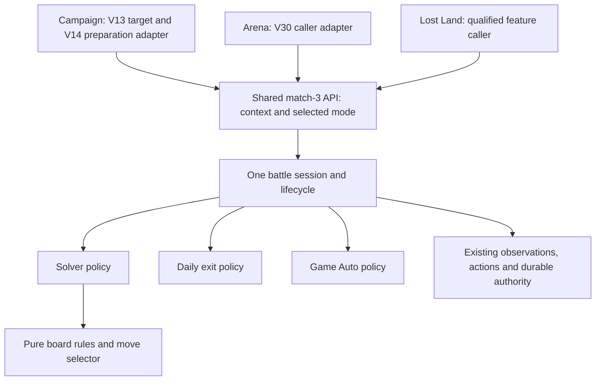

# Shared match-3 component — API, lifecycle and battle modes

**Status:** planned, 2026-09-21; no implementation or live qualification claimed. **Repository base:** `68cb9351c141b9467e3f2a6a54018b38df201d4c`. This plan owns the shared match-3 API and battle execution. The [solver plan](PNC_MATCH3_BATTLE_SOLVER_PLAN.md) separately owns pure rules and move selection. The [battle behavior note](../../../docs/game-reference/workflows/match3-battles.md) records versioned evidence and unknowns.

## Outcome and delivery boundary

Campaign, Arena and Lost Land call one match-3 component and explicitly select one of three modes. Time Rift is deferred until its behavior is understood. All nine context/mode combinations are intended scope; they may be qualified incrementally, with unavailable combinations reported honestly.

| Mode | Behavior when implemented | Completion evidence |
|---|---|---|
| `solver` | Use our pure solver to try to win; execute one observed legal action at a time. Use visibly ready hero skills and ordinary valid target selection, then reobserve. | Independently recognized victory/defeat or explicit stopped/unknown outcome. No guaranteed win. |
| `daily_exit` | Use the earliest qualified Exit/retreat/skip path after an authorized entry. Distinguish skipping a presentation from forfeiting a battle. | Actual exit/result and safe return; the Daily caller separately verifies its exact quest row. Exit alone proves neither victory nor credit. |
| `game_auto` | Use the game's Auto only when unlocked. Leave it on if already on; otherwise toggle once, confirm and wait with bounds. | Observed Auto state and actual result, or explicit unavailable/stopped/unknown outcome. No unlock purchase or silent fallback. |

**First delivery is M0: selectable modes, typed API and explicit unavailable responses, with no implemented battle policies.** V13/V14 and V30 need M0 plus their own caller tests; M1–M4 and the solver are not their completion prerequisites. Visible choices mean documented/public request values and availability in the existing API/authored workflow surfaces, including any existing option help. This work does not require inventing a GUI or enabling unsupported execution.

## Architecture and owners

Feature callers own target selection, qualified navigation/preparation and the eventual safe return. Daily owns quest mapping, pre/post progress, claims, scheduling and total budgets. The component owns entry authorization, active-battle observations/controls, policy dispatch and terminal evidence. Pure solver code never sees a runtime or GUI control.

Use a small PNC-domain contract and a constrained match-3 session adapter following existing `core_hero_hall_session.py` / `core_resource_item_session.py` patterns. Borrow the caller's runtime and lease; do not open another runner, connection or reservation. Do not insert a battle loop into legacy `CampaignTask`, generic task retries, the navigator or `CoreMutationBoundary`.

Keep the existing runner's routed completion for ordinary workflows. The nested component returns a verified result before the parent uses its qualified return route. If battle state is uncertain, stop through the existing error/stop path, preserve evidence and prevent the runner's normal automatic exit navigation; a successful return value must not hide unsafe battle state. An actual result may remain valid even if the later Home return fails. A global `WorkflowSpec` exit-policy migration is not an M0 or V dependency; introduce only a narrowly justified change if M1 execution proves the existing stop contract insufficient.

### Repository evidence informing the split

- `CampaignPolicy.from_params` currently reads `enabled_modes` and ignores unknown fields. Merely documenting `battle_mode` would silently discard it. The affected caller must parse/forward it explicitly and reject invalid values before connection; unknown match-3 request fields cannot silently become preparation success.
- `TaskRegistry` still registers legacy `CampaignTask`; Arena and Lost Land task IDs are not registered workflows at this base. V30 adds a thin feature adapter/API binding, not a fake completed Arena workflow. Preserve existing Campaign preparation calls while package 04 migrates their canonical dispatch.
- `CoreWorkflowRunner` navigates to its declared exit after successful `execute`; battle uncertainty must not return normal success. Existing mutation dispatch already journals before input, and connected Daily rejects unpromoted capabilities before connection. Reuse those owners instead of creating a parallel battle journal or promoting Daily from a mode declaration.
- There are no qualified active-board/result observations yet. V14 distinguishes actual Hero Formation from the older prep endpoint. M0 therefore needs no invented board screen, mutation capability, AP policy or live capture.

## M0 — Shared API contract and unavailable implementation

Define these semantics using existing naming/result conventions; names below describe the intended contract:

| Contract | Required meaning |
|---|---|
| `Match3Context` | `campaign`, `arena`, `lost_land`; no speculative Time Rift member. |
| `Match3Mode` | `solver`, `daily_exit`, `game_auto`, distinct from Standard/Elite difficulty and fixed-stage/progression policy. |
| Availability query | Pure preflight for a context/mode: available, not implemented or unsupported with a reason. Implementation availability is distinct from a later observed Auto lock or missing runtime evidence. Initially all nine combinations are not implemented. |
| Typed request | Exact context, selected mode and typed feature target/preparation reference. Do not duplicate existing Campaign stage/formation receipt schemas or invent unobserved target facts. Runtime execution also requires current identity and exact applicable authority; M0 grants neither. |
| Typed result | Unavailable reason or actual battle outcome plus stop reason and terminal evidence when implemented. Keep battle outcome separate from caller return status and Daily progress. No success, victory, quest completion or fabricated receipt for an unavailable request. |
| Execution API | One entry point taking the request and a borrowed constrained session. It validates availability again before actions; in M0 it returns typed `not_implemented` without accessing the runtime or sending input. |

Expose the three choices through the affected feature request models/help. For existing Campaign calls, omission retains preparation-only behavior and no match-3 execution call. An explicit battle request requires a valid mode; do not choose a default battle mode or reinterpret `enabled_modes`. Direct and authored inputs share the same parser. Check availability before opening a runtime or navigating for a battle request; an already connected caller also checks before new feature actions. Revalidate execution readiness at the shared boundary once modes become available.

Availability preflight needs only context/mode, not a selected stage or connected preparation receipt. Reuse existing typed target facts for the execution contract; define only any missing minimal receipt shape with the V14/V30 adapter owners and land it once in M0. Defining this type does not require their completed routes, package 04's migration or M1's battle observations. Actual runtime readiness remains an execution gate, so the dependency graph has no cycle.

Use one shared production API with a real unavailable implementation. Test substitution belongs at its declared interface using the real typed request/result models, not copied V-local enums or production dummy solver loops. An in-test available implementation can record an execution call; no runtime flag may force unfinished production modes available.

**M0 done:** tests prove all three mode values and contexts survive validation, invalid values fail, availability is honest, and real unavailable requests cannot connect, navigate, spend, retry or report success. Existing preparation-only behavior remains intact. Publish the contract revision so V adapters and pure solver work can proceed independently. No battle observations, spending integration, solver algorithm, exit automation or Auto waiting are required.

## V13/V14/V30 handoff acceptance — depends only on M0

| Owner | Thin integration and definition of done |
|---|---|
| [V13](../vision/modules/V13_CAMPAIGN_MAP_AND_CHAPTERS.md) | Carry selected Campaign target and requested battle mode through the existing feature caller into the V14-owned adapter. Test that selection/context and each of the three modes reach that single adapter unchanged. No second battle call in map navigation or perception. Existing accepted vision coverage remains accepted; this is a pending additive caller amendment. |
| [V14](../vision/modules/V14_CAMPAIGN_STAGE_AND_FORMATION.md) | Own the single Campaign preparation-to-match-3 handoff. Use the genuine typed target/preparation contract; an offline recording API proves one execution call with context `campaign`, each selected mode and preserved source-stage provenance. Propagate the typed result; do not implement any policy. |
| [V30](../vision/modules/V30_ARENA_VERSUS_CENTER.md) | Bind the qualified Arena target/menu context and selected mode to the same API, once per explicit battle invocation. The adapter test uses an evidenced typed menu/target receipt without pretending active battle entry is qualified. It does not alias Arena to Hero Showdown. |

For each production feature adapter, test the real M0 unavailable path **before runtime creation/input**, then its execution handoff using a recording test implementation of the shared API. Import the real contract and test production parsing/composition, including typed result/error propagation and no retry/fallback. A test that only calls a mock directly is insufficient. The Campaign adapter test is shared by V13/V14; V13 additionally proves target/mode forwarding, rather than implementing or testing another battle entry. Preparation-only Campaign requests send zero execution calls.

These tests, plus each V packet's existing perception/navigation acceptance, finish the amended V scope. They establish integration readiness, not battle capability. No solver, Daily-exit, Auto implementation, battle start, quest credit or live combat proof is required. Existing nonspending live route proofs remain scoped to their packet; no new live run is needed solely for API wiring.

Package 04 consumes the V14 adapter when migrating public/authored Campaign callers. V14 exposes it beside the current consumer endpoint correction; it need not finish package 04's broader migration to test the adapter. Package 04 must not create a competing battle controller or make its preparation port wait for M1–M4.

## M1 — Shared observations and authorized lifecycle

Add active, resolving/turn-blocked, victory, defeat and exited observations through one feature producer consumed by both existing publishers. Keep geometry/provenance in the observation/session layer. Demand only decision-critical facts for the selected mode: unreadable tiles block solver decisions, not an otherwise qualified Auto/Exit control and terminal observation. Qualify actual context/rules, Auto off/on/locked/unknown, owned Exit confirmation, continuation setting and safe result/return boundaries.

Compose qualified preparation with one battle-start action through existing exact-identity authority and durable mutation dispatch. Authorization binds castle, context, target, selected mode and observed applicable cost/attempt budget, including deliberate retreat. Extend the existing shared journal only for evidenced AP/Arena/Lost Land resource semantics; do not encode them as Workshop energy or diamonds. Preserve existing consumers and journal data. Reserve cost and attempt before consumptive input; a dispatched start consumes the attempt, even on rejection. Release a resource reservation only on authoritative no-spend evidence. Ambiguity retains it and prohibits replay, including across restarts.

Carry source-stage/target evidence through formation with provenance and invalidate it when selection/navigation changes. Do not pretend source AP/stage fields are visible on formation. One invocation means one battle: establish Auto-next/continuation disabled before spending, or stop. Unknown action state stops without speculative Back, generic popup dismissal, return navigation or replay.

**Done:** deterministic session/authority tests cover fresh observations, exactly-once dispatch, accepted/rejected/ambiguous reconciliation, no replay after restart, safe completion versus unsafe stop and retained battle evidence if return fails. Existing consumers keep their safety behavior. This foundation does not mark any mode/context operational until its policy and evidence gates pass.

## M2 — Independently deliver the three policies

- **Solver policy:** integrate the [pure solver](PNC_MATCH3_BATTLE_SOLVER_PLAN.md). Require player control and Auto proved off; disable observed already-on Auto once and confirm before solver input, or stop. Execute one fresh-frame legal move/special click, settle and reobserve. Use visibly ready skills, select only a valid visible target when required and reobserve after each resolved skill. Bound turns, elapsed wait and repeated unchanged states. Individual hero-effect forecasting stays out of scope.
- **Daily-exit policy:** qualify what Exit/skip/retreat and its confirmation actually do in each context, then execute the earliest safe authorized sequence once. Return the actual result or uncertainty. A presentation skip is not assumed to be a forfeit, refund or Daily completion. No solver gestures or manual skills.
- **Game-Auto policy:** observe unlock and on/off state, leave already-on Auto alone or toggle/confirm once; stop explicitly if locked or unknown. Wait with bounds for the actual result and prevent another battle. No solver moves, manual skills, unlock purchase or mode fallback.

**Done per policy/context:** production composition and appropriate fixtures prove its controls, termination and unavailable behavior without duplicated context loops. Solver depends on its pure algorithm; Auto and Exit do not. Each policy may land independently. Availability is promoted only for the qualified implementation/context, not all modes at once.

## M3 — Feature and Daily operational integration

Reuse the V handoffs for Campaign and Arena. Qualify Lost Land's current route/preparation and bind it to the same API; static captures alone do not qualify combat. Lost Land is separate from Land of Trial and V33 Lost City Headquarters. Keep target/stage selection and formation policy with their feature owners; no formation edit is authorized here. Arena's exact battle family and its relationship to the catalog's `HERO_ARENA` / Hero Showdown quest remain evidence gates.

Direct, authored and Daily callers use the same component and explicit mode. Daily preserves its own connected lifecycle, capability promotion, total budgets and exact observed quest objective. Capture before/after progress for applicable modes, distinguishing unchanged, advanced, complete and unknown. For fast exit, unchanged/unknown progress stops the shortcut without replay or another mode; participation does not satisfy a win/clear objective without evidence. Claims remain separate. Any further Daily attempt needs a fresh result/progress check and separately reserved authority within remaining total budget.

**Done:** implemented bindings use the shared API with no nested runtime, duplicated loop, blind retry, implicit battle default or automatic capability promotion. The Daily plan's full battle delivery may wait for working policies; the V packets' contract-only acceptance may not.

## M4 — Operational qualification and live limits

The retained allocation from the original solver plan is **one Campaign solver attempt, at most 20 AP total**, on the currently selected unlocked stage and active castle of configured `testing`. It is not a per-mode budget and adds no Arena/Lost Land attempt or Auto/Exit canary. Resolve exact target, cost and authority before input. No castle switch, refill, formation edit, reward claim or replay is added. No live action occurs during this planning revision.

Use saved evidence first. The authorized solver canary records identity, stage/cost receipt, authority, first settled board, actions, HP/turn/skill changes and actual result. If one attempt cannot qualify recognition or the model, report the gap; do not repeat it to finish acceptance. Later Auto/Exit or other-context proof needs an exact action, target and resource/attempt ceiling. Reuse shared-control evidence where valid rather than spending to fill nine cells. A Daily-exit proof includes the actual pre/post quest row; Auto proof includes unlocked/on-state and no next battle. Current build/rule mismatch or uncertain action stops execution.

Run focused component/caller groups and `py tools/run_tests.py affected --base origin/main --explain` for source changes. Shared observation/authority schema changes and final combined integration warrant the full runner. Live verification uses the repository live skill and one canonical lease; generated traces stay under ignored `.local-data/`. Planning-only changes need link/diff checks, not unit or live runs.

## Coordination and completion

Land M0 once, then V adapters, pure solver and M1 can advance against its contract. Coordinate only actual shared symbols/catalog registrations and authority changes; no whole-file or whole-roadmap lock. Pet Workshop is independent feature ownership, with its own solver and workflow; PW packets are not match-3 prerequisites. Reuse landed shared infrastructure and preserve its consumers rather than assigning battle work to PW.

Report API handoff acceptance, implemented policies and operational qualification separately. The full requested feature is complete when all three modes work in Campaign, Arena and Lost Land with sufficient context-specific evidence. M0 or completed V packets alone do not meet that full release claim. Time Rift, direct socket automation, formation optimization and individual hero-effect prediction remain outside this plan.
