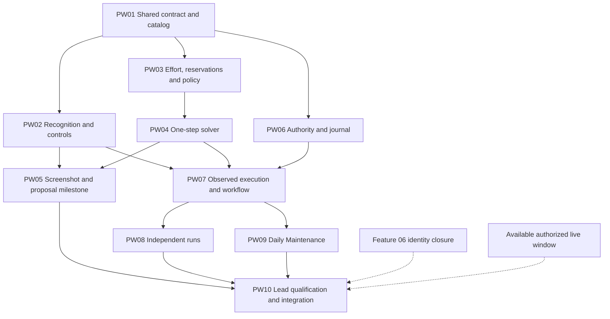

# Pet Workshop roadmap — separate delivery packets

Updated: 2026-09-22 UTC. **5/10 packets merged/pushed: PW01, PW02, PW03/PW04 and PW06. PW05 is fixing findings from completed live006 at c920dad; cedar-stealer turn023 owns the consolidated recognition/harness corrections. Main is stopped, its lease released, and its original role/config hash restored. The shared Growth popup correction is accepted at87834fa after independent live review and exact-source final integration checks (2,838 passed/seven environmental skips); its main landing includes this record. PW07 correction turn009 continues offline. No Workshop energy has been consumed.**

Growth integration acceptance: climbing-foxtrot002 tested485f012 once, full fingerprint `54cb73c6e5421b83eb44a3e36fb24d2a725ae86cdcd48dbcbb0d48cdc679ea32`, independently recomputed by lead. All2,838 tests passed with seven environmental skips. Docs-only rebase to current e9ef10f produced87834fa; production/tests/tools are byte-identical to tested485f012. Actual live-tested c920dad Growth runtime/profile/tests match this isolated slice. No substantive conflict or new live effect was introduced. Source/result proof: popup-integration checkout `.local-data/review/lead-growth-integration-proof.json`; separate native/input/cleanup proof remains PW05 `lead-live006-proof.json`. Accepted main516f6d3 was pushed and remote verified. This accepts only the shared popup boundary; PW05 packet and gameplay gates remain open.

Manor continuation at08:03Z: freed third slot assigned to `apple-chokeberry` turn001 in `pet-workshop-home-entry`, baseline fcb344b (main516f6d3 plus preserved private draft). Lead and V independently qualified two nonoverlapping native fixed Manor parts in one landmark group, without threshold/scan/zoom changes; positive saved views localize and the insufficient latest view remains rejected. Worker owns semantic target/camera data/captured tests and only measured-target-set wiring, while fearless009 retains Workshop graph/context/workflow. Original exploratory label offset must be removed. Supervisor16008/bootstrap49280 startup verified and run registered with the existing monitor. No live authority added; final review/integration and separate Devin live gate remain.

Latest live006 review: exact native Home→Growth offer→Home replay through both candidate publishers proves `growth_boost_weekly_pass_full_height`, measured native bounds(30,7,110,96), and the one actual dismiss tap(85,55). Lead also inspected fresh active Hopium K157 C31 identity and final Home;18 actual inputs, zero switch/spending, all cited artifacts present. PW05 remains unaccepted: ready-button detection varies across clearly ready captures, detail recognition drops one of three Fruit5 icons and misreads a single chest reward, and the harness must explicitly reacquire content after closing a detail panel. Green fulfilled Fruit5 was observed; the worker's absence claim is corrected. Native captures become regression fixtures and boundary tests; no new simulator gameplay rule is implied. Review `.local-data/review/pw05/review-live-released-turn006.md` and proof `lead-live006-proof.json` in PW05 checkout. Separate final-candidate live validation remains required after corrections.

Latest PW05 continuation: implementation turn022 lacked a native final-response marker, but preserved clean tracked commit `c920dadd3c52d7e3ae538582120561516628f255` and complete artifacts. Lead reviewed the actual production/harness delta, verified exact full-run fingerprint `29540e4746cebe5a75ce0c409743016ad8ae0fb9d0f1876669dcd5ec1fcb6bdf` (2,850 passed/seven skips), and independently reran64 harness checks. Same `laced-ferryboat` live session resumed as turn006; supervisor31148/bootstrap42884 startup verified. Main was stopped and its canonical lease was verified free without ADB before temporary role change. One bounded1,200-second recognition phase, configured Hopium only, one switch only if fresh identity differs, zero spending, latest08:35Z/hard09:00Z. Review `.local-data/review/pw05/review-turn022.md`; restoration record `main-role-restore-growth-20260922.json` in PW05 checkout. Growth identity/measured dismiss/Home recovery must be proven from actual candidate captures if naturally present; absence remains awaiting validation. No acceptance or merge from the offline pass alone.

Latest PW07 review: **fixing findings** at `22d4192013d8e78849e3e01d6bcd545b42e18013`. Lead reproduced false duplicate/empty endpoint proofs, unresolved clipped-card assembly, changed-level episode reuse, wrong duplicate binding, planner/session survey disagreement, and unsafe continuation from Bag. One coherent correction batch R8-01–R8-07 also covers pending-submit survey/resume and continuous cooldown. Same `fearless-sprite` session resumed offline as turn009; startup verified. Exact review/reproductions: authority checkout `.local-data/review/pw07/review-turn008.md`. Reported 2,941 passes/seven skips have a source fingerprint different from the returned candidate, so are not final-source acceptance. Focused corrected evidence and final integrated/full/live gates remain required. No PW08/PW09 delegation yet. Simulator-backed lawful transitions and the corresponding survey/navigation fault regressions are explicit acceptance cases.

Latest PW05 review: `.local-data/review/pw05/review-live-released-turn005.md` in PW05 checkout. Loading/brief Home was observed after the selection, but the final native image is a rendered Growth offer; increasing a timeout alone does not address the missing profile. Resulting active castle remains unproven and must be freshly checked, never inferred from the failed workflow result. Eleven actual inputs, no replay or Workshop action. Lead verified Main cleanup through canonical lease and host inventory, without ADB. `cedar-stealer` turn022 starts at cleanly rebased `e54ec1d` (production/tests/resources identical to525807b); owns only `growth_boost_weekly_pass`, captured-family eligibility, safe measured Back and related tests/note. No generic fallback, loading/matcher/camera change or budget extension. V coordinator acknowledged ownership. Separate final-candidate live retest remains required before accepting this fix or PW05. Native callbacks continue; no user intervention required for the scoped correction.

Hopium preparation turn021 was reviewed against canonical selection/config/runtime ownership. Lead corrected partial detail-template acceptance and incomplete early-stop case sets; clipped-card/Fruit4 annotations add no new required natural appearances. Final ignored harness is cleared at `.local-data/review/pw05/live-preparation/preparation.json`, review `.local-data/review/pw05/review-turn021.md`. `laced-ferryboat` live005 executes frozen525807b, one1,200-second phase/180-second return reserve/30-second release margin/60inputs, latest08:35Z and hardend09:00Z September22. Root Main canonical lease availability was checked and released without ADB before dispatch; original read_only role restoration record is PW05 checkout `.local-data/review/pw05/main-role-restore-hopium-20260922.json`. Missing natural variants remain awaiting validation; no acceptance from a successful harness exit alone.

### Latest continuation: live turn 004 reviewed

Lead reviewed native baseline, board, detail and final Home against typed reports and the 16-input audit. Delayed Lucifer appeared after Home and the existing measured close returned to Home. C0/C1/C5 and the executed survey/detail navigation boundaries passed. The captured fruit was Fruit4, not Fruit5; the fully visible unreadable card was not clipped; the complete two-piece feed order was not a lasso order. Missing natural variants remain open. Review: PW05 checkout `.local-data/review/pw05/review-live-released-turn004.md`; native evidence under root `.local-data/artifacts/2026-09-22/pet_workshop_pw05_recognition_525807b_ready/`.

`cedar-stealer` turn021 prepares ignored harness changes only for configured Main target `npc_on_hopium` (K157 / NPC on Hopium), whose selected identity is shown in the original September16 lasso exploration. One separately reviewed canonical switch is authorized; the future recognition phase remains zero-spending. Lead reviews preparation before `laced-ferryboat` executes. Main release ends September22 at05:00 Toronto. PW07 `fearless-sprite` turn008 remains the independent workflow/survey owner; PW08/PW09 await its accepted interface. Requested all-account current-energy depletion, including Hopeful, awaits reviewed gameplay and live authority gates.

Shared Lucifer slice `e665220` + `525807b` is independently qualified by captured-sequence regressions, final offline proof and actual live004. Its isolated candidate `9b87cdb` passed all 2,836 portable tests with seven environmental skips and no failures; lead independently recomputed fingerprint `7573cba93cef296788ae052afa45d961e8b04d36947f1e61526a1626825db3ac`. Clean rebase over the newer status-only main produces `21381a2bbefcc480becf2b73907e686775e4de3b`, with identical runtime/tests/resources; only two status documents differ from the tested tree. The slice is accepted for landing, independently of PW05. Exact result/proof: integration checkout `.test-impact/popup-integration-results.json` and `.local-data/review/popup-integration/lead-source-proof.json`. V coordinator owns the157_farm V44 phase; PW holds no reservation there. Native completion callbacks and the single Python monitor continue automatically.

[Shared contract and recognition](PNC_PET_WORKSHOP_01_RECOGNITION_STATE_PLAN.md) · [Solver and policy](PNC_PET_WORKSHOP_02_SOLVER_POLICY_PLAN.md) · [Execution and integration](PNC_PET_WORKSHOP_03_EXECUTION_INTEGRATION_PLAN.md)

## Start here

This roadmap follows the organization used by the [OCR vision roadmap](../vision/PNC_VISION_ROADMAP.md): one entry point for dependencies, progress and assignments, with a separate Markdown file for each coherent packet. There are **nine implementation packets and one lead-owned qualification/integration packet**. The three design plans remain the canonical specifications; packet files own implementation steps, scoped proof and handoff. Do not copy the gameplay policy or shared interfaces into each packet.

Start with **PW01**, then use three independent lanes: **PW02 recognition**, **PW03 → PW04 solver**, and **PW06 authority/journal**. Once their consumed implementations are accepted, **PW05 screenshot/proposal review** and **PW07 observed workflow** can proceed alongside each other. PW08 independent runs and PW09 Daily Maintenance follow the accepted PW07 implementation. PW05 remains mandatory before any live gameplay; PW10 joins its acceptance, both entry points and the required live qualification.

Implementation was authorized on 2026-09-16. The lead coordinates the Devin implementation → independent review → fixes/offline checks → applicable live validation → merge/push → next eligible packet cycle below. Up to three independent Devin workers may run in isolated worktrees. The lead owns review, live resources, the progress table and integration.

The follow-up interview is resolved in the existing canonical owners: [level-linked order/producer evidence](PNC_PET_WORKSHOP_01_RECOGNITION_STATE_PLAN.md#workshop-progression-and-order-selection), [existing handling of blocked goals](PNC_PET_WORKSHOP_02_SOLVER_POLICY_PLAN.md#level-linked-progression-and-blocked-goals), and [two-way continuation with later-invocation isolation](PNC_PET_WORKSHOP_03_EXECUTION_INTEGRATION_PLAN.md#continuation-and-later-invocations). All packets follow Plan 01's architecture/documentation requirements. These clarifications add no dependency, service or live-validation phase.

### Current execution authority and acceptance gate

**Latest authority, 2026-09-22 UTC:** the user confirmed Main is available **immediately through 2026-09-22 05:00 America/Toronto**, overriding the earlier 01:00 start for this release. They explicitly requested Devin use **all current Pet Workshop energy across the configured eligible accounts/castles, including Hopeful NPC**; the earlier Hopeful exclusion is removed. Use the approved Workshop policy, fresh identity/applicability and canonical leases. No refill, purchase, premium currency or unrelated resource use is authorized. Use current-bar/observed-zero budgets; never report a blocked or unvisited target as depleted. Preserve live review gates and keep independent offline work moving. The scoped first PW05 phase is recognition only with zero spending; separately reviewed gameplay/depletion follows.

**Prior authority, superseded for the explicit release below:** the user confirmed the queue is **PW01–PW10**, with no PW11/PW12. Main may be used only between **01:00 and 05:00 America/Toronto**; this supersedes every earlier timing statement below. During an authorized live phase, temporarily mark Main `live_testing`, hold the canonical lease, verify fresh eligible non-Hopeful identity, preserve pre-existing instances and restore the original role on release. The window does not authorize extra spending: bind each canary's named actions, target and resource/count limits using the existing authorization before dispatch. Do not start a phase that cannot clean up before 05:00. Outside the window, continue independent offline work. Devin owns applicable live execution after the lead's independent review and fixes, on the actual final candidate.

The implementation checkout was synchronized with `origin/main` at `0aab4d7f5a22dd89d85476c8359a05ab3981e28b` before dispatch. Recheck the remote at each integration; this checkpoint does not freeze subsequent accepted changes. The user authorizes merging and pushing accepted in-scope work without another confirmation.

The user's current instruction supersedes any earlier wording that would allow merging a live-observable packet with only offline acceptance. Validate distinct feature-owned use cases and relevant regressions using the actual final candidate before merging. A packet with no meaningful observable live effect needs no live check. Keep work requiring unavailable live proof awaiting validation, record the exact blocker and evidence under the packet's handoff, notify the user, and continue independent eligible work. PW10 still owns combined qualification; its ledger can collect relevant proof earlier rather than postpone a packet's required pre-merge check.

The user has now released **Main no earlier than 2026-09-17 04:25:25 UTC (00:25:25 America/Toronto)**, one hour after the latest instruction, on a C24+ castle other than **Hopeful NPC**. This supersedes the earlier wait for a replacement account; `3xx spies` remains unsuitable at its saved C1–C9 levels. Do not access Main before that absolute time. Resolve Main and an eligible non-Hopeful castle through configuration, fresh identity and one canonical lease; use the active eligible castle where possible. Existing authorization covers a configured non-Hopeful castle selection when necessary. Do not modify local config or preempt another lease. A separate `devin-live-test` worker owns the initial non-spending identity/navigation/recognition evidence pass. Feature acceptance still requires the actual reviewed candidate, and gameplay retains its PW05/identity/authority gates and exact action/target/budget. No live work is needed for PW01.

The timed Main handoff was executed at **2026-09-17 04:26:20 UTC**, after the release. Native session `florentine-selenium` uses isolated checkout `pet-workshop-live-main` at `752cb70` and run `.local-data/devin-live-test/runs/main-evidence-20260917`, turn 001. This is evidence acquisition, not PW02/PW07 acceptance. The same `devin-cache-keepalive-2` was restored to its 27-minute cache-only schedule and the canonical monitor restarted with all registrations, including this live run. The native tool acknowledged the active schedule; the monitor startup command timed out because its retained active lead turn defers its own timer rearm until completion, while health sampling is running. Native worker completion callbacks remain enabled. Do not treat worker completion as acceptance.

Use the status table below as the single queue record. During implementation record **Delegated**, **Under review**, **Fixing findings**, **Awaiting validation**, **Accepted**, **Merged/pushed**, or **Blocked: exact reason**. Untouched packets remain Planned. Record failures with reproduction/command, candidate revision, observed result, artifact references and next action in the affected packet; generated logs stay under `.local-data/`.

## Canonical document ownership

| Document | Owns |
| --- | --- |
| This roadmap | Packet index, dependencies, current status, next assignment and common worker/review workflow. |
| [Plan 01](PNC_PET_WORKSHOP_01_RECOGNITION_STATE_PLAN.md) | Interview decisions, common architecture, sourced evidence, shared model/catalog contract and recognition requirements. |
| [Plan 02](PNC_PET_WORKSHOP_02_SOLVER_POLICY_PLAN.md) | Reward ranking, effort estimates, reservations, legal actions, decision order and scenario expectations. |
| [Plan 03](PNC_PET_WORKSHOP_03_EXECUTION_INTEGRATION_PLAN.md) | Runtime owners, authority/budget, durable receipts, lifecycle, direct/authored/Daily behavior and continuation results. |
| Individual packet | Assigned implementation scope, focused validation and detailed acceptance evidence. PW10 also owns the live qualification ledger. |

The implementation will create `docs/PET_WORKSHOP_DESIGN.md` and the sourced `docs/game-reference/workflows/pet-workshop.md` through PW01. Later workers update their owned sections in those same canonical documents. The plans describe intended work; those implementation documents describe the resulting code and established behavior.

## Packet index and progress

Status is maintained here. Keep detailed review findings, commands, supported coverage and acceptance evidence in the linked packet. The former IDs are a small reference map for earlier discussion; use PW IDs for future assignments.

| Packet | Former ID | Offline implementation dependency | Status | Accepted base / result and remaining condition |
| --- | --- | --- | --- | --- |
| [PW01 — Shared contract and catalog](packets/PW01_SHARED_CONTRACT_CATALOG.md) | C0 | Current accepted repository base | Merged/pushed | Accepted implementation `14b7d68`; 2,574 passed / 7 environmental skips, all 78 Workshop tests passed, portable installed-package proof passed. No live effect. |
| [PW02 — Recognition and controls](packets/PW02_RECOGNITION_CONTROLS.md) | R1 | PW01 | Merged/pushed | Accepted at `1f14e06`; runtime/tests/resources identical to offline/live-tested `b405304`. 2,833 passed / 7 skips; final same-frame board/header, measured return and cleanup passed in 234.6s, zero spending. Partial item/action-state coverage and unqualified Home→Manor production control remain explicit. |
| [PW03 — Effort, reservations and policy](packets/PW03_EFFORT_RESERVATIONS_POLICY.md) | S1 | PW01 | Merged/pushed | Accepted at `4f12095`, with identical production/test content to final-tested `dc810c8`. Independent lead review and corrections complete; 2,741 passed / 7 environmental skips, no failures or errors. No live effect in this pure package. |
| [PW04 — One-step solver](packets/PW04_ONE_STEP_SOLVER.md) | S2 | PW03 policy implementation | Merged/pushed | Accepted with PW03 at `4f12095`; all 166 focused tests included in final full proof. Canonical revalidation covers proposed mutations and current-goal production. PW05/PW07 still need accepted PW02. |
| [PW05 — Screenshot/proposal milestone](packets/PW05_SCREENSHOT_PROPOSAL_MILESTONE.md) | S4 screenshot review | PW02 + PW04 | Fixing findings | c920dad:2,850 passes/seven skips with exact source proof. Completed live006: Growth boundary passed; recognition/detail/harness findings R6-01–R6-04 delegated to cedar-stealer023. Green fulfilled Fruit5 observed; remaining variants and final corrected live proof pending. Main cleanup/role restoration independently verified. |
| [PW06 — Authority and journal](packets/PW06_AUTHORITY_JOURNAL.md) | X1 authority/persistence | PW01 | Merged/pushed | Accepted at `4d39be4`. Independent review closed R1–R4; final full proof: 2,776 passed / 7 environmental skips. Lead integrated contract checks: 129 passed. Production/tests identical to tested `6c835f1`; integration added accepted status docs and a documentation correction only. No live effect requiring emulator proof for this authority/persistence packet. |
| [PW07 — Observed execution and workflow](packets/PW07_WORKFLOW_EXECUTION.md) | X2a + X1 action session | PW02 + PW04 + PW06; accepted V44 capabilities where Home acquisition consumes them | Fixing findings | 22d4192 reviewed; R8-01–R8-07 reproduced and delegated to fearless-sprite009. Canonical simulator-backed transitions plus survey/provenance/return regressions required. Manor acquisition remains lead-owned; full final-candidate offline/live gates pending. |
| [PW08 — Independent runs](packets/PW08_INDEPENDENT_RUNS.md) | X2b | PW07 | Planned | CLI, direct API and authored-task binding; independent of PW09. |
| [PW09 — Daily Maintenance](packets/PW09_DAILY_MAINTENANCE.md) | X2c | PW07 | Planned | Connected Daily adapter; independent of PW08. |
| [PW10 — Qualification and integration](packets/PW10_LIVE_QUALIFICATION_INTEGRATION.md) | X3 | PW05 + PW08 + PW09 for combined acceptance | Planned | Lead can review available offline handoffs earlier. Live phase additionally needs Feature 06 identity closure and an authorized window; missing transitions remain pending. |

The former **S3** was the solver lead-review/handoff gate. It is retained in the common review workflow and PW04 → PW05 acceptance, without inventing an extra implementation assignment.

### Coordinator recovery — 2026-09-21

Task `01a0c548-04ca-7743-a452-8316760518f4` owns continuation, independent review, acceptance and integration; the previous task `Access pnc petworkshop folder` relinquished coordination. Its original sessions and artifacts are preserved. PW05 turn 014 and PW07 turn 005 retained stale `running` files after their supervisors and contained processes disappeared. The lead verified absent writers, exact native session/worktree identities, unchanged tracked source and no assigned external live resources, then saved `recovery-original-state.json` and `recovery-evidence.json` in each interrupted turn before recording failure. Neither interrupted turn counts as accepted work.

The same sessions resumed with scoped delta briefs under each checkout's `.local-data/devin-briefs/`: `pw05-recover-20260921.md` and `pw07-recover-20260921.md`. User-authorized simulator improvements belong to PW07; PW05 uses it and returns concrete gaps through the lead. Simulation never qualifies recognition, navigation or live receipts. The V-plan coordinator confirms V44 candidate `7fe4f19` is not accepted; no PW worker may consume it as an accepted dependency or compete with its shared navigation owner.

The old monitor stopped and heartbeat `devin-cache-keepalive-2` was acknowledged paused. The replacement monitor is `C:/Users/lebel/pnc/.local-data/devin-monitor/pw-queue`, with both runs registered and heartbeat `devin-cache-keepalive-6` acknowledged active. Its native message-delivery test succeeded (`notification-transport-check.json`), and both recovery follow-ups were recorded with `devin_monitor.py resolve`. Callback history was intermittent; successful recovery does not guarantee future delivery. Use the supported callbacks/monitor, inspect actionable failures, and never treat an empty keepalive or worker final response as acceptance. Codex and the computer must remain running for continuation.

The lead rechecked that all five accepted packet revisions and simulator `0724ad7` are ancestors of `origin/main`, and that production/test/tool/script content from PW02's final live candidate `b405304` through its `1f14e06` landing is unchanged. Existing scoped acceptance evidence remains valid; no redundant unit or live run was performed during this documentation/recovery step. Next sequence: review PW05 and PW07 offline handoffs; finish and qualify the PW07 Manor slice after its actual V44 dependency; accept PW07 only after required final-candidate live proof; then PW08/PW09 in parallel and PW10 combined qualification. Continue independent work around any blocked gate.

### Findings fed back into development — 2026-09-22 UTC

The user explicitly requires material findings to improve simulator-based testing and development. For each remaining handoff, identify the canonical owner, evidence/confidence, resulting rule correction or regression scenario, tested revision and unresolved gap. Gameplay transitions belong in the canonical Workshop simulator where supported; pixel recognition belongs in captured fixtures; timing, freshness, input guards, journal interruption and navigation belong in actual runtime/session tests. Do not invent game rules from assumptions or label deterministic scenarios as live observations.

Lead commit `e06908e` in the PW07 checkout replaces separate test-only transition helpers with `WorkshopSimulator` outcomes in connected session tests. It covers catalog-driven production/depletion, exact feeding, merge/activation, recycling, duplicate-card submission and interrupted reconciliation; contradictory captures are explicit injected faults. Three additional simulator regressions prove duplicate-card multiplicity with exact surplus preservation, atomic multi-item shortage and finite disappearance without an authored transform. The combined 64 session + 31 simulator tests passed (95 total). The preceding receipt correction passed 75 focused and 229 neighbor tests. Review/evidence: authority checkout `.local-data/review/pw07/review-turn007.md` and `lead-correction/simulator-regressions.log`. These unmerged tests improve development confidence; they do not complete PW07 or replace live validation.

Native completion callbacks and the existing monitor remain active. PW05 turn 018 is reviewed and awaiting the live window; PW07 turn 008 implements the workflow and bounded survey after the lead resolved its binding design. The existing single-heartbeat scheduling limitation still means no separate 01:00 wake is currently scheduled; follow the recorded window-continuation procedure after worker callbacks and reviewed preparation. Do not claim that the keepalive performs validation or progress checks.

## Delivery waves and parallel work

Solid arrows are code or combined-acceptance dependencies. Dotted arrows are prerequisites for the lead's live phase, not barriers to offline coding.

1. **Foundation:** PW01 establishes the shared types/catalog and pure interface signatures. Publish one accepted implementation commit for the three consumers. It does not implement the future parser, solver or executor and requires no production stubs.
2. **Three offline lanes:** PW02 owns visual facts/controls; PW03/PW04 own the pure policy/planner; PW06 owns authority and persistence. PW06 uses the existing dispatch/reconcile callback boundary and supplied typed outcomes. It does not inspect pixels, choose actions or interpret game transitions.
3. **Two useful joins:** PW05 joins recognition and planning for reviewed saved-image output. PW07 joins those implementations with PW06 for the action session and workflow. Neither joins through the other. PW07 can be implemented and tested offline while PW05 reports are reviewed; it cannot be invoked on a live game ahead of the milestone.
4. **Entry points:** PW08 and PW09 consume the same accepted PW07 implementation/result contract. They are independent of each other and of live-window availability. Keep target sequencing and instance-stop policy in PW07, scope construction in PW06, and adapters thin. A missing common function returns to its owner instead of creating a private replacement.
5. **Live qualification:** after PW05 is accepted, the lead may run the scoped PW10 canaries when identity, target, lease, actions and budget are established. PW10's actual transition proofs then determine unattended promotion; they cannot be required before the very canaries that collect them. Combined offline review can proceed while an external live prerequisite is unavailable.

Prefer one persistent worker per useful lane; no extra worker or packet is needed for the moved action-session scope. PW07 owns the cohesive action-session/workflow slice while preserving focused components in code. Workers may be appropriately authorized Devin coding workers or Luna xhigh agents. The lead owns uncertain shared-interface decisions, cross-packet review, small follow-up corrections and final integration. This organization does not import the other task's worker count, live targets or delivery authorization.

### Dependency review — 2026-09-16

**Implementation-ready after the corrections below.** All ten packets remain planned; this review does not establish live promotion readiness.

| Finding and correction | Repository basis |
| --- | --- |
| Removed the unnecessary PW05 → PW06 barrier. Authority/journal work can finish independently from screenshot and solver work; move operation-specific gesture/receipt interpretation into PW07. | [JournaledMutationDispatcher](../../../pnc_automation/app/automation/daily_maintenance/mutation_dispatcher.py) already accepts dispatch/reconcile callbacks; [its offline tests](../../../tests/unit/app/automation/daily_maintenance/test_daily_mutation_dispatcher.py) use a temporary journal and supplied outcomes. |
| Made the true PW07 dependencies explicit: PW02 controls/route evidence, PW04 planner/validator and PW06 authority/store. Keep PW05 as a pre-live acceptance condition instead of a coding prerequisite. | [WorkflowContext/CoreWorkflowRunner](../../../pnc_automation/app/automation/engine/core_workflow.py) compose runtime observation and mutation authority; [workflow tests](../../../tests/contract/workflows/test_core_workflow.py) supply a fake runtime without emulator access. |
| Keep PW08/PW09 independent and remove hidden reverse dependencies. PW06 accepts explicit typed scope/policy inputs; PW07 owns the connected workflow and shared continuation results. Neither depends on adapter configuration or TaskId registration. | [CoreMutationBoundary](../../../pnc_automation/app/automation/engine/core_daily_mutation.py) already receives typed target/boundary values; [DailyCastleRunner](../../../pnc_automation/app/automation/daily_maintenance/application_service.py) provides the existing connected composition seam. |

The longest planned packet chain decreases from eight to six packets. This is a dependency-count change, not a runtime or delivery-time estimate. The remaining dependencies are actual consumed behavior: shared types/catalog, legal-action/effort functions, measured observations, durable authority, or the canonical workflow. Do not add stub services, speculative interfaces or duplicated policy merely to draw fewer arrows.

## Worker dispatch

### Manor route boundary — 2026-09-21

The [PW07 ownership review](packets/PW07_WORKFLOW_EXECUTION.md#home-entry-ownership-after-the-v44-review--2026-09-21) found no named Illusory Beast Manor route assignment in the V01–V44 epic at `4dfbe8f`; V44 records only the unbound `BEAST_MANOR` system-node entry. Add the target-specific Home entry to PW07, reusing V44's canonical shared navigation. Required unaccepted V44 capabilities block that acquisition/route acceptance, not independent PW05 reports or PW07 action-session work. The earlier isolated Home catalog/label-offset draft is unaccepted and must not be treated as a production route. No new packet, competing city scan or blanket dependency on every V44 feature is introduced.

Before dispatch, read the repository instructions and applicable implementation/source-control skills, confirm task-owned checkout and consumed dependency commits, and reconcile newer landed work. Cross-worker handoffs require an accepted dependency commit. PW03/PW04 may stay with one worker: continue from tested policy code, then return a combined diff for lead review before any other worker consumes it. This removes an internal dispatch/approval pause without deleting their real code dependency. The planning baseline in Plan 01 is evidence, not a fixed implementation base.

Use this brief with the actual packet path, worker choice, base and owned checkout filled in:

> Implement **PWxx** from `plans/reviewed/pet-workshop/packets/<packet>.md`, following its linked canonical design sections and `plans/themed/pet-workshop/PNC_PET_WORKSHOP_ROADMAP.md`. Use the assigned task-owned checkout at the recorded accepted dependency commit. Own only this packet's symbols, profiles, selectors, callers and documentation sections. Reuse the accepted shared models, parser, policy, runtime and journal; return a missing shared interface to its owner. Complete the scoped implementation and smallest relevant offline checks, then return the actual diff, command results and evidence for lead review. Keep unsupported evidence states explicit. Use no live emulator access unless the lead supplies the applicable authorized scoped phase. Commit/push only under the implementation task's delivery instructions.

The read-only `devin-game-knowledge` consultation workflow is not a coding worker. Do not repurpose it by escalating its permissions. Resolve the currently available coding workflow at dispatch; this plan does not prescribe a guessed CLI or start a background process.

Use one task-owned worktree per concurrently active worker. Partition shared files by symbols/profile/selector keys, not whole-file reservations. Avoid competing edits to the same concept. If a shared contract must change, its owner makes the canonical change, migrates affected callers and supplies the new accepted dependency to consumers.

## Worker handoff and lead review

Each handoff includes:

- Packet ID, dependency/base revision, result revision if committed, and task-owned residual edits.
- Changed paths and owned symbols/sections, with the actual diff available for review.
- Passed, failed and skipped commands, plus relevant fixture/report/artifact paths.
- Supported behavior and material uncertainty, including exact live observations still pending.

The lead reviews actual code, decisions and caller paths, resolves substantive findings, and runs only the affected checks after corrections. Worker completion is not acceptance. In particular, the former S3 solver review requires explainable actual decisions and estimate limitations before passing the public planner to PW05 or execution; policy must not migrate into the live runner to unblock integration.

Record detailed acceptance under the packet: reviewed revision, supported scope, meaningful command outcomes, evidence and remaining conditions. Update the corresponding row here with that revision and disposition. Reconcile shared implementation-document edits when combining PW02/PW03 or PW08/PW09. Once consumed dependencies are accepted and present on the next worker's base, assign the earliest useful ready packet within the authorized implementation scope. Do not wait for unrelated packet work or live qualification. The same-worker PW03/PW04 sequence can use one reviewed handoff; record the disposition for both packets.

For a blocked packet, record its exact missing dependency, interface or observation. Continue independent ready work. Repeatedly polling an unchanged state or retrying the same failed live action is not progress.

## Validation and acceptance

The Workshop run operates on the board; storage operations remain excluded. Recognizing an already-open storage overlay is a passive safeguard tested against saved captures, not a reason to open storage during live qualification. Historical live assignments that included intentional storage inspection were broader than needed. Applicable board, route and gameplay validation requirements remain in force.

Use these statuses: **Planned**, **In progress**, **Offline ready**, **Accepted for stated coverage**, **Integrated**, or **Blocked: exact prerequisite**. They describe delivery evidence, not a claim that every underlying repository capability is new. Record partial recognition coverage explicitly; it does not waive PW10's full release requirements.

- **Contract ready for handoff:** consumed interfaces and implementations are reviewed, checked and present in a recorded accepted dependency commit. Same-worker PW03/PW04 development may precede that external handoff; another worker cannot consume unreviewed shared code. No substitute runtime models or stubs.
- **Offline ready:** packet-specific checks pass through the intended production owners; real saved images prove recognition where applicable, and typed synthetic scenarios prove decision/receipt behavior. Synthetic evidence is labeled as such.
- **Accepted for stated coverage:** the lead reviews the actual diff, canonical ownership, caller integration and meaningful tests. Required live proof for the claimed coverage is complete, or the acceptance explicitly remains offline with the missing live coverage assigned to PW10.
- **Integrated:** the accepted implementation and its dependencies are combined and required combined checks pass. Commit/push follows the current task's delivery authorization.
- **Full feature accepted:** PW10's material live transitions and stop boundary are qualified, the Feature 06 identity preflight is closed, and independent/authored/Daily entry points use the canonical behavior. Do not count an offline handoff as this final gate.

Use `py tools/run_tests.py` for focused groups/specific tests, then `py tools/run_tests.py affected --base <accepted-base> --explain` for ordinary source changes. Accept a legitimate full fallback; shared model/schema/authority changes and final combined integration justify `py tools/run_tests.py full`. Do not repeat broad suites for every packet once adequate evidence exists. Documentation-only changes need relevant link/config validation and `git diff --check`, without unit or live tests.

PW02 supplies the reviewed evidence for source controls and destination identities for navigation edges. PW10 owns current production-route and action qualification through the canonical lease/workflow, using the applicable live skills and scoped action/target/budget. A screenshot alone, remembered coordinates or an agent's visual identity assertion do not qualify an unattended route. The existing [Feature 06 regression](../account-runtime/PNC_CORE_REMAINING_06_CASTLE_NAVIGATION_PLAN.md#september-16-regression-native-screenshot-drops-the-selected-hopium-row) stays with its owner.

## Completion

Completion requires all ten packet dispositions to be supported by their actual evidence and the [Plan 03 definition of done](PNC_PET_WORKSHOP_03_EXECUTION_INTEGRATION_PLAN.md#6-tests-and-completion). Report remaining conditions and source-control state accurately. A missing required live state remains pending; do not silently reduce the agreed four-mechanic scope or treat positive-energy blockage as observed zero.

### Workflow resume and simulator — 2026-09-21 UTC

The user explicitly resumed the queue after developing an offline Workshop simulator and renewed Main access for development/live testing, excluding **Hopeful NPC**. This supersedes the pause and earlier Main-release timing. It authorizes the Main live phase and its necessary temporary canonical role configuration: Main is currently saved as `read_only`; immediately before a leased phase, the lead changes only its role to `live_testing` and restores its original role after cleanup. Never bypass roles in memory, preempt another lease, or leave elevated configuration behind. Prefer the active C24+ non-Hopeful castle; authorized configured switching is available when necessary. Exact action/target/budget and candidate revision still belong in each bounded live assignment. Earlier unlimited Workshop-energy exploration permission does not authorize purchases, refill, premium fusion or unrelated resource use.

The shared checkout now matches fetched `origin/main` at `147d77a`; the coordinator was fast-forwarded and PW02 rebased cleanly onto it. The unrelated root `nul`, PW02 `nul` and PW02 generated egg-info remain untouched. The preceding PW02 worker saved an implementation but was never accepted; the screenshot showing four accepted packets remains accurate.

Independent review found five correction groups recorded under PW02. Native session `cedar-stealer` resumed as turn 010 on `0219d42`; this coding phase remains offline. Separately, simulator session `mixed-cheque` is implementing the three reproduced simulator findings on `codex/pet-workshop-sim` at `90c4fdb` plus its pending fixes. Its original suite contained 18 simulator tests; the lead's focused run passed all 184 Workshop tests but independently exposed stale order readiness, stale producer counters after cell reuse and non-accumulating initial cooldown waits. Simulator code is not yet accepted. Supply the accepted canonical simulator revision to later development consumers; do not copy dirty implementations or treat simulated states as pixel/live evidence.

### Simulator acceptance — 2026-09-21 UTC

The simulator is now accepted and merged/pushed at **`0724ad77e414c163e42410475d7acc455902a31c`**. Independent review verified the readiness, cell-reuse bookkeeping and cumulative-cooldown corrections; the lead also corrected stale readiness on incomplete cards. The final integrated candidate passed **2,815 tests, with 7 environmental skips and no failures**, including **28 simulator tests**. A separate lead run passed all 194 focused Workshop tests. Final full-suite evidence lives in the simulator checkout under `.test-impact/sim-integrated-final-{selection,results}.json`; its commit and source fingerprint match the reviewed candidate. No live check applies to this offline logical simulator.

The canonical development owner is `pnc_automation/app/automation/pet_workshop/simulate.py`. Its documented approximations do not qualify pixel recognition, navigation, authority or live gameplay. Shared main was fast-forwarded to the accepted ref, preserving the unrelated `nul`. PW02 remains unaccepted; its turn-010 correction handback is now under independent review. The existing monitor remains active for the resumed queue.

The existing native completion callback and single Python monitor now cover both active workers. Monitor directory: `C:/Users/lebel/pnc/.local-data/worktrees/pet-workshop-sim/.local-data/devin-monitor-review-fixes`; heartbeat remains `devin-cache-keepalive-2`. Continue independent correction review, required validation and integration when each worker returns, then dispatch PW05/PW07 only when their real dependencies are accepted.

### Immediate Main release and requested energy depletion

Fresh live assignment `pw05-main-live-released-20260922` is registered with the existing monitor and native callback, session `laced-ferryboat`, turn 001, supervisor 53440, source `20b39e3`. The lead verified Main's canonical lease was available and released the preflight check, then temporarily changed only Main's role from `read_only` to `live_testing`. Restoration record: PW05 checkout `.local-data/review/pw05/main-role-restore-released-20260922.json`. The assigned recognition phase has one 900-second lease, 120-second Home-return reserve, 30-second release margin, no switching/spending/launch/reconnect, and includes active Hopeful if eligible. Exact-date ReleasedWindow prevents reuse on another day; latest start is 04:40 Toronto, hard end 05:00. A separate 01:00 wake is no longer needed for this phase.

The all-account current-energy request is persisted at root `.local-data/devin-monitor/pw-queue/energy-depletion-authority-20260922.json`, with six configured C24+ Main castles and the other accounts retained for fresh applicability/discovery. Saved levels are routing evidence, not fresh live proof. The active implementation worker received the expanded target/spending objective while retaining its offline scope; reviewed gameplay/depletion receives a separate live assignment. The V coordinator confirms no Main reservation, reports no current serious_stuff live assignment, and subsequently verified release of 157_farm at 2026-09-22T01:56:10Z after V44 live010 cleanup. V44 remains unaccepted due to Institute/ Campaign navigation findings. Do not preempt another lease or infer that recognition validation spent any energy.

The first recognition attempt stopped before ADB because Main was closed and the lead brief disallowed launch. Zero inputs/spending; canonical lease availability independently rechecked and original role restored. No user startup action is required: ordinary configured startup is within the released task. A corrected one-phase assignment resumes `laced-ferryboat` turn 002 after 40 passing harness checks, with a fresh output directory, one app launch, and canonical cleanup that closes only an instance started by this phase. Current role restoration record: `.local-data/review/pw05/main-role-restore-startup-20260922.json` in PW05 checkout. Failure disposition: `.local-data/review/pw05/review-live-released-turn001.md`. No plan acceptance or feature merge follows this setup failure.

Live turn002 is independently reviewed: C0–C4 not-run, C5 Home return failed; one authorized app launch, no taps/swipes/spending. Main original role and stopped state are independently verified. Failure/correction record: PW05 checkout `.local-data/review/pw05/review-live-released-turn002.md`; actual native evidence remains under root `.local-data/artifacts/2026-09-22/pet_workshop_pw05_recognition_20b39e3_startup/`. The final offer matches existing templates, so the fix targets session eligibility rather than new artwork or relaxed thresholds. Offline turn019 is running; PW07 remains independent. All-account current energy is still unspent/pending reviewed gameplay.

Turn 019 review is complete with one scoped lead correction at `525807b`; final source gate is delegated to turn 020 and the future live harness is prepared but not cleared for execution. Detailed review: PW05 checkout `.local-data/review/pw05/review-turn019.md`. Main remains read_only/stopped. `157_farm` is assigned to the V coordinator’s V44 live 012 on 7116e58 until verified release. No PW energy depletion has run.

Turn 020 final gate passed and is independently verified at `.local-data/review/pw05/review-turn020.json` in PW05 checkout. Live turn 003 uses candidate 525807b, new harness output `pw05-main-recognition-525807b`, and brief `pw05-main-final-525807b-20260922.md`. Main original-role restoration record is `.local-data/review/pw05/main-role-restore-525807b-20260922.json`; restore after terminal cleanup. This recognition phase spends zero game resources. Acceptance and requested all-account gameplay remain gated.
