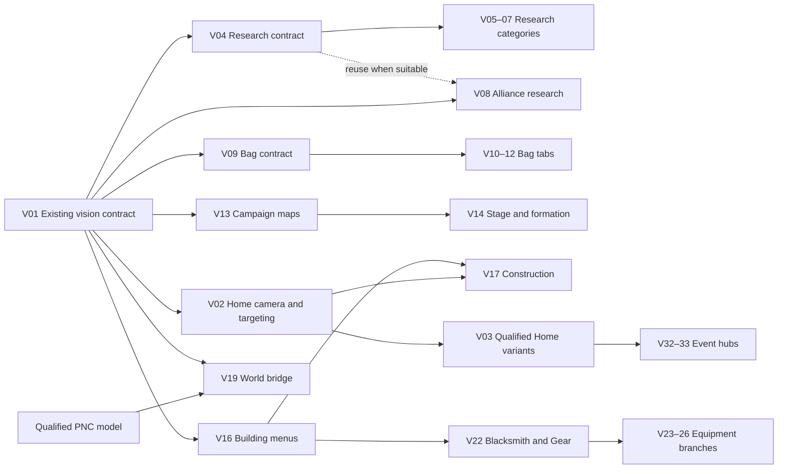

# PNC vision roadmap — 43 implementation packets

Updated: 2026-09-16. Status: **14/43 accepted for stated coverage: V01, V02, V04–V07, V09–V13, V15, V16 and V18. V13/V18 passed combined full acceptance, architecture/caller review and their required live routes. V22 safe entry is prepared while its inventory/detail evidence remains pending.**

[Scope and architecture](PNC_VISION_MODULAR_PLAN.md) · [OCR text modernization](PNC_OCR_TEXT_LOCALIZATION_MODERNIZATION_PLAN.md) · [Building coverage](modules/BUILDING_MENU_COVERAGE.md) · [Evidence](modules/CONTEXT_AND_EVIDENCE.md) · [Dropped-plan replacements](../../reviewed/vision/modules/PLAN_RETIREMENT.md)

**2026-09-21 match-3 amendment:** land M0 of the [shared component plan](../gameplay/PNC_MATCH3_COMPONENT_PLAN.md) once, then complete V13 target/mode forwarding, V14's single Campaign API adapter and V30's Arena API adapter. The API offers `solver`, `daily_exit` and `game_auto` with explicit unavailable responses until implemented. These V slices finish with offline production-caller handoff tests plus existing visual/route acceptance; no solver, Auto/Exit implementation or live battle gates them. V13's accepted vision coverage remains accepted; its additive caller slice is pending. V14 uses V13's already-qualified target contract, so V13's new composed-caller proof is not a circular prerequisite for V14. The count above records historical accepted coverage, not completion of the new slice.

## Start here

**First assignment: V01. Then prioritize V02 and V04.** This proves the existing vision integration, fixes Home acquisition/panning, and completes the Institute/Development inspection path that exposed the original OCR problem.

V01 uses the existing Bag Resource layout. The
[retained navigation findings](modules/CONTEXT_AND_EVIDENCE.md#navigation-findings-retained-in-these-plans)
document the earlier runtime fix and its exact port after `ff38127`.
V11, V13 and V15 preserve the corrected recognition/returns and implement their
remaining content and routes; these packets are not completed by the small fix.

Continue with V09, V13 and V16 to establish Bag, Campaign and shared building-menu contracts. Their dependent features then reuse those contracts. This is the execution-order document; the individual packets remain authoritative for detailed scope, owners, evidence and validation.

The [OCR text recognition and localization modernization plan](PNC_OCR_TEXT_LOCALIZATION_MODERNIZATION_PLAN.md) is planned cross-cutting infrastructure outside the 43-packet count. It owns the shared backend/model/localization comparison and qualification. V10, V13, V15 and other feature packets retain their domain semantics and consume the qualified service. The accepted V13/V18 stack at `f93dd2a` is its baseline. Corpus and benchmark preparation can proceed independently; serialize any runtime promotion with feature integration and reuse unchanged acceptance evidence. This work does not block unrelated ready packets or change the 43-packet count.

The roadmap has **five delivery waves containing 39 packets**, plus **four packets on an availability-dependent track**. Every packet appears once in the tables below. Wave numbers express priority, not a barrier requiring every earlier packet to finish. Start a later packet when its own prerequisites are integrated and its work is the next useful available assignment.

## Delivery overview

| Wave | Packets | Count | Value delivered |
|---|---|---:|---|
| **W1 — Existing foundation** | V01 | 1 | One canonical OpenCV, OCR and observation path ready for feature work. |
| **W2 — Home and reusable menu contracts** | V02, V04, V09, V13, V16 | 5 | Reliable Home targeting plus research, Bag, Campaign and building-menu foundations. |
| **W3 — Requested feature flows** | V05–08, V10–12, V14–15, V17–18 | 11 | Broader research, Bag tabs, Campaign formation, Trial, construction and Hero result inspection. |
| **W4 — Ordinary building menus** | V20–22, V27, V30–31, V34–38, V41–43 | 14 | Training/healing, equipment entry, defense, Alliance support and ordinary building details. |
| **W5 — Equipment branches and deeper menus** | V23–26, V28–29, V39–40 | 8 | Equipment submenus, Relics, Sauroi, Pit and Bank. |
| **E — Appearance, event and model availability** | V03, V19, V32–33 | 4 | Supported Home variants, qualified World detections and available event hubs. |
| **Total** | V01–V43 | **43** | Named planning ownership; completion requires each supported feature's evidence. |

The diagram shows shared prerequisites, not every route dependency. The tables cover all 43 packets. **H** in a table means V02's current Home acquisition for the automated route. It does not block offline parsing of an already-saved menu frame. A parent dependency means the relevant shared contract is reviewed and integrated; unrelated missing variants do not delay work that can use an already-qualified contract.

## W1 — Qualify the existing foundation

| Packet | Prerequisite for its supported scope | Acceptance outcome |
|---|---|---|
| [V01 — Existing OpenCV and observation integration](modules/V01_EXISTING_OPENCV_FOUNDATION.md) | Current baseline | One verified OpenCV/observation path; preserve working profiles and guards. |

**Finish when:** the existing production path and extension points are verified, including both publishers and popup ownership. If current code already satisfies V01, a documented qualification is enough. Do not turn this into another OCR/backend comparison or rebuild already-working OpenCV integration.

## W2 — Home and reusable menu contracts

| Packet | Prerequisite for its supported scope | Acceptance outcome |
|---|---|---|
| [V02 — Home camera localization and atlas navigation](modules/V02_HOME_CAMERA_AND_NAVIGATION.md) | V01 | Home camera localization, measured pan, fresh building acquisition and verified open/return. |
| [V04 — Institute, Development research and shared research parsing](modules/V04_INSTITUTE_DEVELOPMENT.md) | V01; H for route | Institute/Development node and detail inspection, scrolling and queue facts. |
| [V09 — Bag shell, common cards and Resource inventory](modules/V09_BAG_SHELL_AND_RESOURCES.md) | V01 | Bag tab/card contract and correct Resource partial-card handling. |
| [V13 — Campaign map and chapter navigation](modules/V13_CAMPAIGN_MAP_AND_CHAPTERS.md) | V01; H for route; M0 + V14 adapter for new caller proof | Campaign map/chapter facts and Home portal; forward target and all three battle-mode choices. |
| [V16 — Building upgrade, prerequisites and queue menus](modules/V16_BUILDING_UPGRADE_AND_QUEUES.md) | V01; H for route | Shared building upgrade, prerequisite and queue observations. |

**Recommended order:** V02 and V04 first; V09 and V13 next; V16 next or earlier when it unblocks an active building caller. Feature parsing can proceed while V02's route proof is pending. Mark that split explicitly.

**Finish when:** supported Home localization survives a pan and verifies the opened building; each shared menu producer has a reviewed typed result and current measured controls. A useful first acceptance route is Home → Institute → Development → matching node detail → Home. Bag, Campaign and generic-building contracts can land independently.

## W3 — Complete the requested feature flows

| Packet | Prerequisite for its supported scope | Acceptance outcome |
|---|---|---|
| [V05 — Economy research](modules/V05_RESEARCH_ECONOMY.md) | V04; H for route | Economy node → matching detail → return. |
| [V06 — Military research](modules/V06_RESEARCH_MILITARY.md) | V04; H for route | Military node → matching detail → return. |
| [V07 — Fortification research](modules/V07_RESEARCH_FORTIFICATION.md) | V04; H for route | Fortification node → matching detail → return. |
| [V08 — Alliance research categories, nodes and details](modules/V08_ALLIANCE_RESEARCH.md) | V01; V04 reuse if compatible; Alliance access | Alliance categories, nodes and donation-detail facts without donating. |
| [V10 — Bag Speedup cards and item details](modules/V10_BAG_SPEEDUPS.md) | V09 | Speedup type/duration/quantity and safe item inspection. |
| [V11 — Bag Treasure, chest previews and item details](modules/V11_BAG_TREASURE_AND_PREVIEWS.md) | V09; incorporate source preview behavior if absent | Treasure variants, possible-reward preview content and owned close. |
| [V12 — Remaining Bag tabs on the supported layout](modules/V12_BAG_REMAINING_TABS.md) | V09; remaining-tab inventory | The other evidenced Bag tabs, or an explicit no-additional-tabs result. |
| [V14 — Campaign stage detail, Hero Formation and return](modules/V14_CAMPAIGN_STAGE_AND_FORMATION.md) | V13 qualified target contract; nonspending formation entry; M0 for API slice | Stage → actual Hero Formation → return; single tested Campaign match-3 handoff with mode selection. |
| [V15 — Trial Challenge cards and read-only details](modules/V15_TRIAL_CHALLENGE.md) | V01; H for route | Trial card identity/state and one proved read-only detail family. |
| [V17 — Construction slot menus and construction details](modules/V17_CONSTRUCTION_AND_SLOTS.md) | V02 + V16; suitable slot for live route | Construction slot/menu/detail inspection, without constructing. |
| [V18 — Hero Hall menu and saved recruitment result surfaces](modules/V18_HERO_HALL_AND_RESULTS.md) | V01; H for route; saved result captures | Hero Hall and stable recruitment-result content without replaying recruitment. |

**Recommended choices as prerequisites land:** V10/V11 and V14/V15 close the tour's most visible content gaps; V05–07 expand the working research pattern. V08 follows current Alliance access. V17 unlocks later construction/territory coverage. V18 uses saved result evidence; it must not create a recruitment merely for validation. V12 begins with the remaining-tab inventory.

**Finish when:** each selected supported family can identify its content, inspect a safe target and return through its own route, with its limitations recorded. A blocked Alliance category, absent construction slot or unavailable Hero result blocks only that qualification; continue independent ready packets.

## W4 — Cover ordinary building menus

| Packet | Prerequisite for its supported scope | Acceptance outcome |
|---|---|---|
| [V20 — Barracks training and unit information](modules/V20_BARRACKS_TRAINING.md) | V01 + V16; H for route | Barracks unit/tier information, queue presentation and information details. |
| [V21 — Infirmary healing menus](modules/V21_INFIRMARY_HEALING.md) | V01 + V16; H for route | Infirmary wounded/healing facts and owned information controls. |
| [V22 — Blacksmith hub and Gear inventory](modules/V22_BLACKSMITH_AND_GEAR.md) | V01 + V16; H for route | Blacksmith/Gear hub, inventory/detail and shared equipment primitives. |
| [V27 — Market and resource-transport menus](modules/V27_MARKET_TRANSPORT.md) | V01; V09 resource contract; H for route | Market recipient list and transport form kept semantically distinct. |
| [V30 — Arena menus and match-3 API handoff](modules/V30_ARENA_VERSUS_CENTER.md) | V01; H for route; M0 for API slice | Versus Center/Arena rows and safe previews; tested match-3 API handoff with mode selection. |
| [V31 — Sacred Tree and blessing records](modules/V31_SACRED_TREE.md) | V01; H for route | Sacred Tree and Blessing Record content/return. |
| [V34 — Wall and Defense Info menus](modules/V34_WALL_DEFENSE.md) | V01 + V16; H for route | Wall/Defense Info facts and verified settled destination. |
| [V35 — Watchtower reports and information](modules/V35_WATCHTOWER.md) | V01 + V16; H for route | Watchtower empty/alert/report information where captured. |
| [V36 — Trap Workshop and effect tables](modules/V36_TRAP_WORKSHOP.md) | V01 + V16; H for route | Trap Workshop, Effect Table and observed queue facts. |
| [V37 — Alliance Hall and reinforcement menus](modules/V37_ALLIANCE_HALL_REINFORCEMENT.md) | V01 + V16; H for route; Alliance access | Preserved Alliance Hall/Reinforce rows plus missing information details. |
| [V38 — Hall of War and rally information](modules/V38_HALL_OF_WAR.md) | V01 + V16; H for route | Hall of War rally/status and information/Glory Level detail. |
| [V41 — Castle and Territory Overview](modules/V41_CASTLE_TERRITORY.md) | V01 + V16 + V17; H for route | Castle/Territory Overview without confusing Go, Build and Unlock. |
| [V42 — Warehouse, resource buildings and Recruiting Center details](modules/V42_UTILITY_BUILDING_DETAILS.md) | V01 + V16; H for route | Warehouse/resource/Recruiting Center shared details with exact building identity. |
| [V43 — Goddess Statue menu and information](modules/V43_GODDESS_STATUE.md) | V01 + V16; H for route | Goddess Statue attributes and current versus preview state. |

**Recommended choices:** V22 first where useful because it unlocks four equipment packets. V30, V31 and V38 already have useful captured hub/return evidence; preserve it and add missing semantics. V20/V21 address training/healing presentation. Order the remainder by a current caller need and available captures rather than touring every building first.

**Finish when:** each supported menu family reuses the shared entry/upgrade machinery, publishes its own content and owns its popups/return. Four Barracks or multiple utility buildings may share a parser, but exact building identity and demonstrated layout compatibility remain required.

## W5 — Equipment branches and deeper menus

| Packet | Prerequisite for its supported scope | Acceptance outcome |
|---|---|---|
| [V23 — Gem and Saurgem inventories](modules/V23_GEM_AND_SAURGEM.md) | V22; evidence for each included family | Gem/Saurgem identities, slot/item facts and inspection. |
| [V24 — Warsigil menu and details](modules/V24_WARSIGIL.md) | V22 | Warsigil inventory/loadout presentation and information. |
| [V25 — Hero Curio inventory and details](modules/V25_HERO_CURIO.md) | V22 | Hero Curio inventory, equipped association and details. |
| [V26 — Ascend menu and requirement details](modules/V26_ASCEND.md) | V22 | Ascend target/requirements/preview facts without ascending. |
| [V28 — Sanctum and Relics menus](modules/V28_SANCTUM_RELICS.md) | V01; H for route; reuse existing card helpers if suitable | Sanctum/Relics tabs, sets, owned pieces and effect details. |
| [V29 — Sauroi Lair and Sauregg menus](modules/V29_SAUROI_AND_SAUREGG.md) | V01; H for route; V03 for a variant-specific route | Current Sauroi Lair/Sauregg menu and information. |
| [V39 — Pit and Rare Earth menus](modules/V39_PIT_RARE_EARTH.md) | V01; H for route; current Pit endpoint | Pit/Rare Earth information, explicit entry/return and no dispatch. |
| [V40 — Bank and current Treasure Cave endpoint](modules/V40_BANK_TREASURE_CAVE.md) | V01; H for route; current Bank endpoint | Bank's actual current menu and terms/status information. |

**Recommended choices:** V23–26 can start as soon as V22's contract lands, even while other W4 buildings remain. V28 reuses only compatible existing item primitives; it does not require a new general inventory framework. V29's ordinary available Lair menu can proceed before seasonal qualification. V39/V40 begin by resolving their current endpoints.

**Finish when:** the supported family has an explicit current menu/detail/return contract. If capture discovery reveals a substantially different subtree, split that work into a named follow-on before expanding the packet. A declared enum or an old source-code route does not satisfy acceptance.

## E — Work when the required evidence is available

| Packet | Prerequisite for its supported scope | Acceptance outcome |
|---|---|---|
| [V03 — Home appearances, seasonal references and event slots](modules/V03_HOME_APPEARANCES_AND_EVENT_SLOTS.md) | V02; captures for each appearance/slot variant | Qualified seasonal references, present/empty/unknown event slots and Sauroi variants. |
| [V19 — Qualified World detections into current navigation](modules/V19_WORLD_PERCEPTION_BRIDGE.md) | V01; qualified current PNC model/class contract | One qualified World object class through canonical perception and inspection. |
| [V32 — Dragondom event-building menus](modules/V32_DRAGONDOM_EVENT.md) | V01 + V02; V03's relevant slot proof; event evidence | Current Dragondom hub and one read-only detail/return. |
| [V33 — Lost City Headquarters event menus](modules/V33_LOST_CITY_HEADQUARTERS.md) | V01 + V02; V03's relevant slot proof; event evidence | Verified Lost City ID/slot, current hub and read-only detail/return. |

This track is **not the final mandatory barrier for ordinary menus**:

- Start V03 once V02 is stable and a useful variant capture exists. Track ordinary/seasonal appearance, each event slot and Sauroi variants separately. A missing Christmas capture does not block an already-proved event-slot contract.
- V32/V33 depend on their relevant occupancy/identity proof, not on every V03 variant. Absent events remain pending; no need to wait for an event during another packet.
- V19 starts from the current model owner's actual qualified export/class evidence. Its runtime integration is separate from training and cannot block Home or menu work.
- Other packets can also lack captures or access. Record the exact blocker against that packet instead of moving all work into an indefinite research phase.

## Dispatch and integration

### First assignments

1. Reconcile the current branch/base and newer feature01/02/04 work against the
   retained evidence. The source Campaign/Trial/chest fix is `4d317db`; its
   runtime changes and fixtures are ported after `ff38127`. Preserve that
   baseline in V11/V13/V15 and scope their remaining content/routes. V01 starts
   independently from the existing Bag profile.
2. Assign **V01** and accept its qualification or necessary small integration correction.
3. Assign **V02** and **V04** as the first independent feature slices.
4. Take **V09** and **V13** next, then **V16** and the highest-priority ready W3 feature, typically V15 or a Bag tab.
5. Continue from the earliest useful ready packet. A dependency that is only needed for live Home entry may remain pending while offline producer work proceeds.

### One coherent packet per worker

Use the dispatch prompt in the plan index. Each worker owns its feature's producer, controls, navigation/callers and proof. This roadmap does not start workers or authorize implementation by itself.

For the current implementation, the user requested **up to three persistent Devin SWE-2 Max workers** for independent concrete packages. The lead owns uncertain analysis, shared interfaces, architecture review and integration. Increase concurrency only when symbols/profile IDs are independent and consumed shared contracts are already integrated. Keep one owner for Home localization, common research, common Bag and common equipment helpers. A small shared correction belongs to that owner and should land before dependent feature edits.

The user has delegated all live testing in this roadmap to Devin through [devin-live-test](../../../.agents/skills/devin-live-test/SKILL.md). The live worker owns the canonical process lease, authorized checks, curated evidence manifest and cleanup. The user reauthorized `mega_old_acc` on September 17 alongside `3xx_spies`; use a declared target bundle, configured live roles and active castles, preserving each capture's actual target provenance. The lead defines acceptance, reviews the packaged evidence and resolves implementation findings; it does not duplicate live probes. Use bounded Devin game-knowledge consultation to resolve missing facts before assigning dependent live checks. No resource spending or account/castle switching is authorized by this delegation. Continue automatically through all 43 packets: review each handback, resolve findings, delegate applicable live proof, merge/push accepted changes and assign the next ready packet without another user prompt. Coordinate by feature symbols and profile/control keys rather than assigning the entire enricher file to one worker. Do not revive the dropped A/B wait rules.

As explicitly requested on September 17, the Join Alliance popup bug and its dedicated verification are excluded from this entire epic, its worker assignments and its acceptance gates. The [standalone popup plan](../operations/PNC_ALLIANCE_INVITATION_DISMISSAL_FOLLOWUP_PLAN.md) owns the cause, existing merged fix `4f1e119` and still-pending post-Home live proof. Do not seek or wait for the popup while executing these 43 packets. Continue the original recommended order and independent ready work. Gear inventory/detail/return, Arena details and Alliance feature packets V08/V37 remain in scope. If the popup actually prevents a required feature route, record that external obstruction without bypassing guards or claiming the route passed; continue other safe work.

### Acceptance and integration gates

- **Contract ready:** the dependency's consumed interface is reviewed, tested and present on the worker's base.
- **Offline ready:** the changed parser/control path passes relevant real-capture checks through both production publishers. Synthetic semantic tests supplement those checks.
- **Review complete:** the lead has reviewed the actual combined change for correctness, canonical ownership, caller integration and meaningful regression coverage. Worker completion alone is not acceptance.
- **Route qualified:** after review and before merge/push, Devin runs the bounded non-spending proof and the lead independently reviews its evidence of the changed behavior when it applies to an observable live instance. A current screenshot and process exit do not prove the route. If a required live boundary is unavailable, record the exact blocker and hold that merge while independent packets continue. Offline-only changes need no unrelated live route.
- **Accepted for stated coverage:** the supported layouts, behavior, review and required checks are complete; unresolved variants remain explicitly listed.
- **Integrated:** the exact accepted change is combined with its dependencies and the required combined checks pass. Commit/push follows the implementation task's delivery authorization.

Run the smallest useful packet validation and the repository-required affected checks. Reserve broader integration checks for shared-contract changes or the combined branch; do not repeat a full suite for every menu. No additional broad live tour, resource spending or account/castle switching is introduced by this roadmap.

## Progress tracking

At creation, every packet's dispatch status is **Planned**. This is not a claim that the underlying feature has no existing implementation. Before assigning a packet, reconcile what is already landed and record only its remaining delta.

Record status changes here in the following compact log; use the linked packet for detailed evidence. Valid statuses: **In progress**, **Offline ready**, **Accepted for stated coverage**, **Integrated**, or **Blocked: exact prerequisite**. A partial qualification must name the supported and pending surfaces.

| Packet | Status | Base / result commit | Evidence, supported coverage and remaining condition |
|---|---|---|---|
| Baseline correction | Integrated with these plans; no packet completed | Exact runtime/fixture port of `4d317db` after `ff38127` | Chapter 6 recognition/Home portal, Tower destination/return and chest-preview ownership/close. V01-V43 remain planned; V11/V13/V15 retain their content and broader route acceptance. |
| V01 | Integrated and pushed to main | Base `552bb766619e7997c8d7898ccd7bfd414f7bdf6f`; result `f1ecc683e06c0da7b6d46e21d18e40ba3d39bc65` | 2026-09-16 UTC: both publishers qualified with real bounded OCR on Bag reference and independent validation capture; Home negative, demand/cache/provenance and guard regressions passed. 56 core vision tests, 445 vision integration passes (6 optional skips), 198 final affected passes; merge gate: 2,186 full portable passes and 7 expected skips. No runtime change or new live route required. One reference Safe Food row remains explicitly unreadable; V09 owns that improvement. See V01 for evidence and extension owners. |
| V02 | Integrated and pushed to main | Base `32a03492a2b83684582cb1868928d531c2064180`; result `55d3d7f0e428140db922f431ad6603478c2563eb` | September16: one canonical camera,16 landmarks/10 groups, fresh measured Institute/Tower/Campaign bodies and bounded replanning. Lead architecture/caller review and corrective checks complete. Full2,275 passed+7 skipped; later focused corrections passed. Non-spending core live Institute, Tower/Trial and default Home -> two pans -> Campaign map -> Home passed on mega_old_acc. V03 owns appearance variants. See V02 for exact evidence. |
| V04 | Integrated | Base `55d3d7f`; result `0dcc68d3201999a43c087a2c8de4220e72d1dcf4` | Typed Research rows/detail/queue and both-publisher provenance; lead architectural/caller review plus R1–R5 and freshness/max-panel fixes complete. Full fallback 2,314 passed + 7 skipped; subsequent focused checks passed. Non-spending Home → Institute → Development → scroll → matching Infirmary Cap I 5/5 detail → tree → queue → Home passed on mega_old_acc; no Start/premium action. See V04 for evidence and scoped limits. |
| V09 | Integrated and pushed to main | Base `f1ecc683e06c0da7b6d46e21d18e40ba3d39bc65`; result `32a03492a2b83684582cb1868928d531c2064180` | September 16: shared Bag geometry/typed selection, selected and unselected Resource/Speedup/Treasure controls, clipped rows and Safe Food crop retry. Lead architecture/caller review resolved ambiguous-source selection locally. Full offline: 2,208 passed, 7 skipped; lead 17 captured/navigation checks plus 13 correction checks passed. Core live on mega_old_acc: Home → Bag → Speedup → Treasure → Resource → one scroll → Home, five complete and two non-actionable clipped rows. No spending; instance preserved. V10–12 own remaining tab semantics/controls. |
| V15 | Accepted for stated coverage | Base `0dcc68d`; worker snapshot `cabf1c0` plus lead corrections in this acceptance commit | Six typed Trial cards and Gear Applicable Stats through both publishers and canonical navigation. Architecture/caller review complete; full 2,347 passed + 7 skipped, 31 focused corrected checks passed. Production Home → Tower → Gear Stats (nine rows) → Trial → Home passed on mega_old_acc, runtime `20260916T102239Z_f31a49a3`, zero spending. Gear is the only qualified detail family; see V15 for exact evidence and limits. |
| V13 | Accepted for stated coverage | Integrated source `684c78923641a2c039d16df87979f3637c158152`; acceptance recorded by this commit | Canonical Campaign facts and OCR backend, corrected Research/Bag integration, and architecture/caller review complete. Combined portable run `1598ae0a7e6b49f0aec8c8bebcac9e48`: 2,496 passed, 7 skipped, no failures. Leased Home → Campaign map → Chapter 5 → map → Home passed; corrected Economy/Military detail routes also passed. Zero spending. Unreadable stage markers remain non-actionable; V14 owns formation/stage detail. |
| V18 | Accepted for stated coverage | Integrated source `684c78923641a2c039d16df87979f3637c158152`; acceptance recorded by this commit | Phase-owned Hero Hall result content, both publishers, explicit safe acknowledgment and existing receipt/session integration reviewed. Combined full run passed. Saved native presentation/fragment results qualified offline; Home → Hero Hall → Home passed live on mega_old_acc. No new recruitment was created; current live result and independent result holdout remain unavailable as permitted by V18's saved-evidence scope. |
| V10/V11 | Accepted for stated coverage | Base `7127266`; result is this acceptance commit | Shared typed Bag card/preview owners, bounded OCR and canonical-identity magnifier navigation. Lead architecture/integration review and corrections complete. Full2395 gate with7 skips; two failed methods corrected and focused checks passed, including26 unit,7 navigation, both captured preview layouts and independent900-pixel Arena holdout. Live Speedup observation plus Common preview → fresh Treasure → Home passed on mega_old_acc, runtimes `1853a038`/`463bd47d`, zero spending. Speedup has no qualified inspection control; Arena/Common are the only qualified preview families. |
| V16 | In progress | Base `0dcc68d` | Worker 2 implements the resolved shared building detail/queue contract, existing caller migration and non-spending primary-menu inspection boundary. Final lead review/live proof remain. |

To choose the next assignment: filter out integrated/accepted work as appropriate, check the packet's own dependencies and available evidence, then select the earliest useful ready item. A blocked packet is not a reason to repeat the same failed live action.

## Roadmap completion

The first useful milestone is reliable Home → Institute research inspection. The next is the requested Home/research/Bag/Campaign/Trial coverage, followed by ordinary building and equipment families.

Full roadmap completion means all 43 packets have an accepted disposition with exact supported coverage and required integration proof. Blocked required interfaces remain incomplete; do not report “all buildings supported” while hiding unqualified menus. New events or substantially different future layouts remain explicit follow-on scope.

This roadmap updates sequencing only. The [modular plan](PNC_VISION_MODULAR_PLAN.md) owns architecture/validation policy, individual packets own feature details, and the [retirement map](../../reviewed/vision/modules/PLAN_RETIREMENT.md) preserves requirements from dropped plans.
