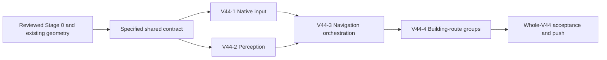

# V44 — Full Home-city mapping, localization and building navigation

Date: 2026-09-18; design and qualification reviewed 2026-09-25. **V44 remains unaccepted. Stage 0 now supports sampled native zoom normalization and deliberate drags; next implement normalized-zoom, landmark-based navigation within that evidence.** Retain the existing 54 ordinary slot pivots and 16 system markers. Earlier route/zoom evidence is historical and does not accept the revised navigation contract. Execution resumed by the user: finish V44 before the dependency-ready V queue, preserving external ownership. V44-1/2/3 shared publication is accepted for its recorded scope; V44-4 and the current scanner/perception corrections remain in progress. Exact candidates and per-case acceptance live in the coordinator ledger.

[Index](../PNC_VISION_MODULAR_PLAN.md) · [Roadmap](../PNC_VISION_ROADMAP.md) ·
[V02 baseline](V02_HOME_CAMERA_AND_NAVIGATION.md) · [Building coverage](BUILDING_MENU_COVERAGE.md)

## 1. Outcome, scope and sequencing

**September 30 priority amendment:** the user prioritizes maintainable code,
canonical ownership, testability and the development/validation workflow over
fast V44 closure. Follow the reviewed [quality sequence](v44/V44_QUALITY_REVIEW_AND_SEQUENCE.md)
before further route fan-out or copied live-helper expansion. Its bounded
publication, test-ownership and live-tooling packages supersede the old immediate
route-first dispatch order. Preserve accepted work and the broader V44-first queue;
coordinate actual shared boundaries rather than holding all M/PW work.

From a partial recognized Home view, execute:
**recognize Home → normalize to minimum magnification (fully zoomed out) →
verify zoom and locate the camera from landmarks → resolve candidate slots →
pan → rescan/relocalize → verify the building → click once → verify the destination**.
A full-city scan is a fallback or an explicit discovery request, not a prerequisite
for every building request.

The [September 29 game-knowledge review](v44/V44_NAVIGATION_KNOWLEDGE_REVIEW.md)
reconciles this design with the extracted scene and packaged input/click handlers.
Its reviewed entry clarifications apply to all four slices; it adds no fifth slice.

“Minimum zoom” means the widest city view, not the smallest numeric camera size.
The recovered client uses orthographic size 4–10, where 10 is widest. This is
offline evidence of a likely endpoint; native input, scale and endpoint recognition
must pass Stage 0 before becoming a runtime contract. Do not claim a numeric live
camera size from screenshots alone.

V44 replaces the provisional full-city plan and becomes the 44th packet. Preserve
V02's accepted Institute, Tower and Campaign routes. V44 depends on V01/V02 and
owns the remaining shared geometry, zoom, occupancy and acquisition work through
their existing interfaces. Feature packets retain their menu content and returns.

On resumption, prioritize V44 before new navigation-dependent work. Unrelated
implementation and offline feature parsing may continue. Accepted V02 routes
remain usable. New shared-interface consumers wait for their integrated contract;
remaining Home-entry validation waits for its target-specific route qualification.
Whole-V44 completion and permission to resume the broader V queue remain separate
from acceptance of a useful shared unit. Existing incomplete work is preserved.

Direct dependencies include remaining Home-entry work in V17, V20–22, V27–31 and
V34–43, plus unqualified Home routes of other packets. V23–26 inherit Blacksmith
entry through V22. V03/V32/V33 consume the qualified shared map but retain their
own appearance/event prerequisites. Unrelated work such as V19 World perception
does not gain a Home dependency. V44's ordinary coverage does not depend on V03
event qualification: an absent event cannot create a dependency cycle.

**Selected acceptance scope:** account for all 54 ordinary slot definitions and
separate system nodes; verify every retained available ordinary catalog building type on
the authorized castle. Equivalent repeated instances do not each require a live
route. Evidence-backed unavailable targets retain individual blockers and do not
hold unrelated available coverage. An unknown or failed-to-detect target cannot
be relabeled unavailable to pass acceptance. Never report universal account,
appearance or menu support from this acceptance.

### October 2 user-directed scope reduction

The user excludes the following buildings from V44's route implementation,
caller migration and entry/destination/return acceptance requirements:

| Excluded target | Catalog identity / related feature packet |
|---|---|
| Sanctum | `sanctum`; V28 |
| Bank | `bank`; V40 |
| Lost City Headquarters | Event target outside the ordinary catalog; V03/V33 |
| Dragondom Conquest | `dragondom_conquest`; V32 |
| Moon Well | `moon_well`; resource |
| Farm | `farm`; resource |
| Lumber Camp | `lumber_camp`; resource |
| Iron Mine | `iron_mine`; resource |
| Gold Mine | `gold_mine`; resource |

**October 3 amendment:** the user additionally excludes the five resource
buildings above from supported V44 route work and all required
implementation, live and migration acceptance. The same exclusion rules
apply — all 54 static geometry entries, reusable landmarks and historical
evidence are preserved; no resource routes, tests or live cases are added.

These rows are **excluded by user**, not accepted, unavailable or failed. Their
unfinished routes, menu recognition, return controls and event qualification do
not block V44 or require further V44 live checks. All other targets retain their
existing scope, applicability and external ownership boundaries. Campaign and
Illusory Beast Manor access remain in scope.

Preserve existing catalog identities, geometry, landmarks, published behavior and
historical evidence. Removing route requirements does not remove the 54-slot map
or permit weakening shared recognition, input or test-selection contracts. Park
unfinished excluded-target source and evidence; do not land it as accepted work
or extend it merely to close V44. Shared independently useful changes still need
their own review and applicable validation.

Apply this exclusion list when freezing inventories and assignments. Record
excluded rows separately from the retained acceptance denominator. Related
feature packets retain their own status and ownership; this scope decision does
not complete their features or qualify their missing Home entries. Reintroducing
these routes requires a separate scope decision. This amendment supersedes older
Bank-first dispatch and Bank/Watchtower cohort instructions.

The Alliance invitation bug remains outside the epic. The September 25 request
authorizes the bounded Devin Stage 0 live/game-knowledge assignment on `157_farm`
and this plan revision. Existing permission to launch that instance and keep it
warm persists. That historical Stage 0 scope did not authorize account/castle
switches or feature mutations. Current non-Main feature testing follows the
September 30 standing resource authority in the canonical live skill; incidental
collection and assigned feature spending need no repeated permission. Main and
explicit target/switch restrictions remain protected. Further implementation
follows the reviewed quality sequence; the broader queue is not resumed here.

## 2. Map and occupancy model

Reuse `HomeCityMapAtlas` and the existing semantic catalog, including IDs such as
`blacksmith` and `wall`. Do not make workflow callers use raw client type IDs.
Keep the current inferred 2800×3200 atlas and 900×1600 reference basis unless
calibration disproves them; correct the canonical mapping rather than adding a
second map.

| Concept | Required facts | Interpretation |
|---|---|---|
| Slot definition | Ordinary/system identity, eligible semantic types, qualified geometry and source | Static geometry and eligibility; not actual occupancy |
| Occupancy observation | Slot association, observed occupant or empty/locked state, frame and context | Current evidence; unknown and occluded remain distinct |
| Camera proof | Relative zoom, translation, landmark consensus, residuals and provenance | Current map-to-image measurement; not tap authorization |
| Scan state | Request budget, observed regions, inspected candidates and remaining route | Transient progress, not a persistent account database |

Extend existing typed domain/spatial models only where these consumed facts are
missing. Scope occupancy to the current connected runtime and established castle
identity. Invalidate it on context change or lost identity; if a reliable context
key is unavailable, keep it request-local. Historical occupancy is a search hint
only. Persist reviewed geometry and fixtures, not assumed universal occupancy.

Build an inventory for all 54 entries plus declared system/catalog targets. For
each, record semantic binding, eligibility, geometry source and evidence gaps.
Apply decoded table defaults. Reconcile current UI names against established
endpoint evidence rather than translating internal names by guesswork.

Calibrate geometry from existing overlapping captures with independent landmarks
and holdouts. A bounded offline extraction of Unity scene transforms may improve
precision; include ancestor transforms and map into the same atlas. If extraction
fails, proceed with image-atlas calibration. Slot numbers do not give coordinates.
Do not infer an unseen slot's position from its number or a guessed grid. A slot
without qualified geometry is recorded as uncalibrated and cannot guide a pan.

**Stage A progress (2026-09-22, offline):** the lead-reviewed parent-composed
scene extraction plus label-fit calibration (`lead-review-v44-calibration016-20260922`)
is published through `home_city_slots` backed by tracked package data
`pnc_automation/app/pnc/data/home_city/scene_geometry.json`. All 54 ordinary
slots publish `atlas_coordinate` under evidence
`cityscene_pivot_calibration_20260922`; all 16 extracted `sys_*` markers publish
geometry via `home_city_system_markers()` while the declared 15-node semantic
table is unchanged (5013 stays undeclared; 5016 binds to
`HomeCityObjectId.ILLUSORY_BEAST_MANOR` through the integrated PW Manor
candidate — archived `sys_16` marker plus reviewed 2026-09-21 destination
evidence). The integrated camera catalog is 26 landmarks / 5 targets; the
Manor is a fixed `reference_slot=None` target whose owl-head and right-tower
landmarks share one `illusory_beast_manor_structure` group, the PW02 native
frame localizes at (-521,-1346) z1.0 with measured action (511,722), and the
PW006 hopium_growth frame stays `insufficient_independent_landmark_groups`.
The transform is the single shared fit (k `108.24698772671348`,
tx `−681.4851210137155`, ty `−180.35407805478746`) at zoom 1.0 with 6 reference
px recorded uncertainty (LOO max 3.6155 px). Measured pivot extent x
`−332.2803..2357.2244`, y `370.6231..3724.9806` is published as geometry extent
only — `HomeCityMapCoordinate` accepts signed integers; no camera clamp, pan
lane, or reachability is derived from it. Native zoom captures at sampled
scales 1.0 and ~1.072 are preserved as production-publisher regressions
(2026-09-22 wheel turn-020); the measured off-grid scale localizes at
(-603,78) with 9 correspondences in 6 groups, and restored scale 1.0 at
(-532,73) proves zoom restoration is not pose restoration. Still open for
Stage 0→C: qualification of the fully zoomed-out endpoint, normalization input,
panning/body recognition at that endpoint, live scan/occupancy producer, per-target
candidate resolution consuming these pivots, and ordinary route migration.

## 3. Camera localization and visual identity

### Normalize first

Every new Home acquisition/discovery operation starts with bounded normalization
to the qualified fully zoomed-out endpoint, including the already-visible target
path. Do this once at entry, not before every pan in the same operation. A fresh
endpoint proof may make normalization an observation-only no-op; an old command
count or remembered scale is insufficient. Reentry to Home, an unexpected scale
change or lost continuity invalidates the proof. Unexpected change during a request
stops that request; a new operation must normalize again, without silently resetting
the previous operation's budgets.

Use only the native input method and bounded procedure qualified in Stage 0.
Use a visually qualified noninteractive scene anchor for wheel input; label-box
avoidance or a flat-looking patch alone is insufficient. The worker reported an
earlier wheel input opening a building page; its initial phase lacks direct trace
proof, so the causal claim remains provisional. The reviewed diagnostic helper is
not a production backend: integrate input through the existing actuator,
authorization, lease and cleanup owners, not by copying the diagnostic harness.
Verify endpoint scale against qualified native landmark evidence and observable
saturation, with evidence that the input method actually changes zoom away from
the endpoint. An unchanged frame alone cannot distinguish saturation from ignored
input. Unknown or failed normalization stops navigation with a typed unresolved
reason. Never silently continue at the previous zoom or apply a guessed number
of pinches. The normalization and settling attempts have a finite qualified bound
and do not reset the navigation gesture budget.

Invalidate all old camera translations, body bounds and click points after zoom
input. Reobserve and localize even when zoom returns to a previously seen value;
the saved wheel captures already show that equal zoom does not restore pose.

### Landmarks establish pose

Extend the existing `HomeCityCameraProof`, its canonical vision producer and all
projection consumers together. Add measured relative zoom and inverse projection:

```text
reference-screen point = zoom * atlas point + translation
native-screen point = reference-screen point * resolution conversion
atlas point = (reference-screen point - translation) / zoom
```

At zoom 1, preserve V02's translation convention. Image-resolution scaling is
separate from game zoom. Do not publish absolute world units or orthographic size
without a calibrated world-to-atlas mapping.

Use the existing OpenCV matcher to verify the normalized scale and fit camera
translation. Retain bounded scale discrimination for normalization/precondition
checks and detecting unexpected changes; arbitrary-zoom navigation is not required.
Qualify the endpoint and recognition tolerance from native saved captures; optimize reuse
of prepared frames and template variants. Fit uniform scale and translation from
agreeing correspondences. Retain at least three matches from two independent
scene groups, with enough spatial separation to distinguish scale from translation.
Reject an ill-conditioned fit or a competing plausible location. Preserve existing
accepted-scale thresholds; changed tolerances require held-out positives and
negatives. Failure to separate them is a qualification blocker, not permission to
lower the threshold until a target appears.

Stable terrain and structures establish camera location. **An occupant whose slot
is not fixed cannot be an unconditional fixed-position landmark.** Audit existing
Blacksmith/Alliance Hall landmark assumptions: use verified slot bindings or omit
those votes until independent landmarks establish location. Candidate slot
projections may propose matches but cannot supply circular proof of themselves.

Building artwork and bounded name OCR verify target identity. Similar barracks,
HUD, advertisements and animated effects cannot establish location by themselves.
Match target bodies at the measured zoom and derive current clickable bounds from
the body match; scaling an atlas point is not a body detection.

One producer supplies both `ObservationBuilder` and `NavigationPerception` using
the existing frame/OCR context and provenance contract. Zoom, layout or camera
changes invalidate old action geometry. Scale-normalized residuals and motion
comparisons must use consistent units.

Keep one matching engine. An ORB comparison is a separate evidence-driven option
only after documented patch-matching failures; it is not a second default path.
Qualify sparse asset-derived landmark candidates against real screenshots before
replacing proven patches. Reuse the canonical asset-to-atlas transform and its
54-slot/system geometry; do not build another map or a pairwise distance table.
Compute target displacement from coordinates under the current landmark fit.
Map-edge homing and accumulated gesture distances are not normal pose sources.
If normalization succeeds but landmarks remain insufficient, report unresolved
localization; normalization is not camera-position proof.

## 4. Target selection, panning and scan state machine

### Target selection

Keep `NavigationCore.open_building` as the orchestration entry and
`open_visible_building` as the final fresh-body operation. Preserve existing return
and error contracts. Add an optional typed slot selector to both only for exact
instance requests; thread it through reacquisition so the selected instance cannot
silently change. Reject slots incompatible with the semantic target before action.
Existing callers retain their semantics, including any narrower selection policy.

Resolve a target in this order:

1. A fresh verified visible instance satisfying the caller's request.
2. A previously observed compatible slot, as a hint requiring fresh verification.
3. Its single eligible calibrated slot or system node.
4. Visible eligible candidates, then the nearest uninspected calibrated candidate;
   use stable slot ID as the tie-breaker.
5. A bounded coverage search where candidate geometry or occupancy is unresolved.

For a generic repeated-type request with no existing stricter policy, use the
first confidently verified instance in this order. Do not infer highest level.
Explicit slot selection overrides generic ordering and is retained until completion.
Blacksmith searches eligible slots 11–13 rather than a universal fixed coordinate.

### One measured pan at a time

Project the next candidate or search region into the current view. Bring the
building body toward the existing HUD-safe acquisition band, using the Stage 0
qualified gesture envelope. Prefer the fewest effective pans that retain landmark
overlap, using horizontal/vertical movement initially; diagonal input is optional
and requires its own evidence. Gesture calibration estimates an action; it never
proves the resulting camera position. Do not assume tiny corrective drags work.
When the desired correction is below the reliable gesture size, choose a qualified
larger/repositioning route and rescan, or return unresolved when none is available.

Qualify ground-start, building-start and building-crossing gestures separately.
Replace narrow empty-ground corridors only where actual event-routing and motion
evidence supports the broader envelope. Requested endpoints before actuator jitter
are not execution evidence: qualify actual issued coordinates, duration and input
transport. Fit bounds to observed behavior, not a universal 40px or 70px threshold.

Preserve overlap with qualified landmarks. Use reviewed connecting corridors
when a direct pan would lose them. Convert corridor constraints into atlas-space
view/waypoint conditions through inverse projection; do not carry V02's raw
translation thresholds unchanged across zoom.

After each gesture, require the existing stable-observation condition, obtain a
fresh frame, recompute scale and translation, invalidate old click points, update
coverage and occupancy, and replan. Do not integrate swipe distances into camera
truth. Unexpected zoom changes stop the current request with `ZOOM_CHANGED`;
a new operation must normalize and relocalize. They never count as camera
translation or silently restart the consumed budget.

### Coverage-driven search

Maintain two separate measurements: usable terrain coverage and slot occupancy
inspection. Mask HUD and overlays. A projected slot counts as inspected only when
enough of its relevant region is visible at a qualified recognition scale.
An unresolved body match is not verified empty or absent.

Search target candidates first; otherwise visit adjacent uncovered regions in
deterministic overlapping passes. Use a serpentine pattern only where the reviewed
landmarks and gesture lanes permit it. Deduplicate measured regions/candidates;
do not replay the fixed scan merely because the target remains unfound.

Progress is either useful new coverage/occupancy **or measured advancement along
the chosen route toward a target or connecting waypoint**. Revisiting known
terrain along a necessary corridor is valid progress. Cycling through known
regions without route advancement is not. Do not use raw screenshot difference
as progress; animation is not camera movement.

Full discovery is an explicit bounded core operation returning typed coverage,
occupancy and stop reason, without tapping occupants. Reuse the same scan state
and planner as building acquisition; do not create another scanner or raw gesture
API. A single discovery request need not cover the whole city at every zoom.

### Budgets and recovery

- Use the current canonical `home_city_scan_step_budget()` (18 gestures at this
  baseline) as one request budget shared by initial acquisition, directed movement
  and fallback search. Preserve existing bounded per-action observation policy;
  do not add unbounded waits or reset the budget between phases.
- Initially unlocalized Home may normalize only with current qualified anchor and
  scene evidence under the interface contract. It may not pan until fixed-landmark
  pose is established. The earlier provisional six-step unlocalized acquisition
  allowance is retired; a recognized Home screen alone does not authorize it.
- If localization is insufficient after input, allow at most three fresh passive
  observations in total, within the same operation deadline. Stop if unresolved;
  do not pan from stale proof. This finite policy is not a measured settling guarantee.
- Measure camera movement using inverse-projected viewport/landmark positions at
  a common zoom. Preserve the existing 12-reference-pixel stall behavior at zoom 1;
  zoom changes are handled separately. A stalled direction is not retried unchanged.
  One distinct qualified alternate route is allowed if available; a second
  consecutive no-progress action ends the request. All attempts consume the budget.
- Stop on exhausted limits, stale evidence, ambiguous localization, unknown
  obstruction or unexpected destination. A stop returns remaining coverage gaps;
  `not found within budget` never implies `absent`.

### Tap and destination verification

For map-assisted acquisition, require current camera proof plus an independently
verified current body. Preserve the existing direct visible-building path where
its identity and geometry independently satisfy the contract after the same
normalization entry gate; a full map scan is not needed for an already verified target.

Reacquire immediately before tapping. Require the requested identity/slot,
unobstructed body and HUD-safe measured action geometry. Tap once through the
existing actuator and require the known stable destination. Do not recover a wrong
menu by guessed taps or Android Back. Use the feature-owned verified return route.

A matched body alone does not establish a non-mutating entry. Qualify the current
action point clear of visible floating completion/collection/help bubbles and
area/unlock controls using native evidence; ambiguous overlap leaves the case
pending. Do not infer collider rectangles from a slot pivot. Resource body
handlers can themselves collect even at an off-bubble point. Apply the
[V44-4 entry contract](v44/V44_4_BUILDING_ROUTE_MIGRATION.md#entry-semantics-and-collection-effects)
before dispatch; confirmation cannot undo an unintended action.

## 5. Implementation stages and integration ownership

### Stage 0 — Qualify gesture behavior first

One source-read-only Devin live-test assignment incorporates the existing
game-knowledge consultation and decoded client assets. The lead owns design and
independent evidence review. Complete this gate before changing navigation policy:

1. Resolve `157_farm`, its configured live role and active castle; establish the
   canonical lease, identity and Home preconditions. Preserve warm instance state.
2. Verify which supported native input changes zoom, its direction, settling and
   fully zoomed-out saturation. Demonstrate convergence from materially different
   start scales and an idempotent request at the endpoint. Distinguish a recognized
   endpoint from ignored input, and record the bounded procedure and uncertainty.
3. At normalized zoom, qualify deliberate horizontal and vertical drags using a
   clear-ground start, then a visible building start/crossing where safe. Record
   the actual actuator-dispatched coordinates/duration/transport, fresh before/after
   landmarks, camera displacement, postcondition and accidental click/menu results.
   Use a small hypothesis-driven comparison, not an exhaustive threshold sweep.
4. Relate failures to the observed boundary: event classification, interception,
   lock/multitouch, camera clamp/damping, settling, or missing evidence. Do not
   assign a cause from zero motion alone. Capture normalized-scale recognition
   gaps separately from input failures. Continue independent safe cases.
5. Return one curated live manifest and a compact knowledge memo labeling facts,
   inferences, confidence, asset/build provenance and remaining unknowns. Recommend
   the smallest reliable gesture envelope and next implementation slice. The lead
   accepts or rejects each qualification from cited evidence and updates this plan.

This is a development qualification checkpoint, not whole-V44 acceptance. Source
edits, production normalizer implementation, broad building coverage and resource
actions are outside the live worker's assignment. Existing partial patches remain
preserved. Failed/unobserved cases require a specific new hypothesis, corrected
candidate or changed precondition before retry; no repeated identical probes.

### Stage 0 reviewed result — 2026-09-25

Devin exercised clean candidate `56eb7dd0eee60619f8ab28bc30b140258839ddb4`
on `157_farm`, active castle `0 sticker NPC` / K157, 900×1600 layout. Lead checked
39 native-frame hashes, actual jittered dispatches and native before/after frames;
offline replay of endpoint and final captures succeeded with all movable landmark
votes removed. Accept these observations as development qualification:

| Boundary | Supported result | Limit |
|---|---|---|
| Normalize zoom | Native wheel +1 zooms out; sampled starts ~0.779 and ~0.871 converge near relative atlas scale 0.743; an additional outward input is idempotent | Not an internal camera-size read or proof from every initial zoom/layout |
| Landmark pose | Both publishers agree at the endpoint; fixed-only replay retains three independent scene groups | Current observed poses only, not whole-city landmark coverage |
| Horizontal pan | Actual (269,704)→(541,705), 429ms moved the scene and retained clear Home | Translation delta ~594 reference-image pixels, not world units or universal gain |
| Vertical pan | Actual (717,544)→(717,864), 425ms moved the scene ~54 reference-image pixels | Camera boundary/damping may limit motion; intrinsic axis asymmetry is unproven |
| Body-start pan | Actual Institute start (462,892)→(535,685), 488ms panned without opening a menu | One body/pose; this does not qualify every interactive object |
| Further drag/rescan | (223,943)→(262,782), 434ms panned; first post-frame insufficient, second localized | Aim was through a body's pre-drag location; collision with the moving body at release is unproven |

The final settled frame is clear Home at measured z~0.7395. Small pose-dependent
fit variation does not establish a zoom change. Use native landmark fit and
settling evidence; the worker's sparse patch displacements and cumulative scale
were unreliable across large pans and must not become runtime truth. One passive
observation can recover localization; unresolved pose still prohibits another pan
or stale tap. Exact minimum duration/drag size and microdrag effectiveness remain
unqualified. Initial production work can use the sampled deliberate-drag approach
with observation feedback; expand its envelope only when needed and proved.

Evidence in the primary checkout:
`.local-data/devin-live-test/runs/v44-zoom-gesture-20260925/turn-001/evidence.json`,
`.local-data/devin-vision-pipeline/v44-gesture-independent-review-20260925.md`, and
`.local-data/devin-vision-pipeline/v44-gesture-independent-proof-20260925.json`.
The lead's companion reviewed manifest is authoritative for acceptance scope.
Two retained phases contain 22 wheel events and 8 drags; initial-phase counts and
cleanup are incomplete. Full assignment-budget compliance is not certified.
Recovered UNKNOWN-entry/identity incidents and the reported earlier unexpected
building page are published in the weekly collections. The diagnostic harness
must not be reused with per-process budget resets or overlapping incident IDs.
No new live replay is required solely to improve that historical reporting gap.

### Lead-owned Stage C candidate — 2026-09-22

The lead checkout implements one request-local measured scanner for building
acquisition and typed, non-tapping discovery. It retains exact slot identity
through fresh reacquisition, selects compatible candidate slots from calibrated
geometry, and reports terrain coverage separately from qualified body-region
inspection and observed occupancy. Inspected but unmatched bodies stay unknown.
Unsupported off-screen targets no longer enter the old blind six-step tour.

The same 18-gesture budget covers directed movement and discovery. Each action
requires fresh measured camera evidence; route advancement counts across known
corridors, one distinct axis may follow a stall, and repeated lack of progress
stops. Lost localization permits one passive capture; ambiguity stops immediately.
Zoom changes invalidate previous planning geometry and cause replanning in that
historical candidate. The revised contract additionally requires normalization.

This is an implementation candidate, not Stage C live acceptance or whole-V44
completion. Qualified body catalogs still bound discovery scope; unqualified
ordinary/system targets, broader native zoom/gesture-lane coverage, remaining
feature-owned destinations/returns, and final-candidate Devin live proof remain
outstanding. An inspected slot is not evidence of an empty or unavailable building.

### Four implementation slices

The remaining implementation is split into exactly four separately assignable
packets below. These replace the previous B–E implementation-stage grouping;
Stage 0 remains the research prerequisite and completed Stage A geometry is reused.
They remain part of V44, not additional V45+ plans. The slice documents define
their implementation scopes; this parent owns shared behavior, evidence,
authorization and whole-V44 acceptance. This planning update leaves execution idle.
The lead has specified the [binding interface agreement](v44/V44_INTERFACE_CONTRACT.md)
and expanded every packet with ordered steps and named acceptance cases. The
agreement is a shared reference, not a fifth implementation slice. Its design is
ready; production implementation and empirical qualification remain incomplete.

| Slice | Separate implementation plan | Dependency and concurrency | Exit evidence |
|---|---|---|---|
| **V44-1** | [Native input and dispatch evidence](v44/V44_1_NATIVE_INPUT.md) | Stage 0 + specified contract 1; parallel with V44-2 when execution resumes | Authorized production wheel/drag dispatch, actual input trace, cleanup and scoped live capability proof |
| **V44-2** | [Normalized-view perception](v44/V44_2_NORMALIZED_VIEW_PERCEPTION.md) | Stage 0 + same specified contract; parallel with V44-1 when execution resumes | Qualified endpoint/anchor evidence, fixed-landmark pose and fresh bodies through both publishers |
| **V44-3** | [Normalization and navigation orchestration](v44/V44_3_NAVIGATION_ORCHESTRATION.md) | Reviewed integration of V44-1 and V44-2 | Normalize→localize→resolve→pan→rescan→tap; bounded discovery/occupancy and representative final-candidate live routes |
| **V44-4** | [Building-route migration and coverage](v44/V44_4_BUILDING_ROUTE_MIGRATION.md) | Reviewed V44-3 contract; independent building groups may run in parallel | Available V44-owned route coverage, destination/return proof, regressions and final integration |



### Interfaces and exclusive ownership

The [interface agreement](v44/V44_INTERFACE_CONTRACT.md) is the canonical source
for exact retained/new signatures, typed payloads, units, frame lifetime, wheel
transport deployment/cleanup, action receipts, trace serialization, normalization
states, budgets, stop reasons and shared-symbol ownership. Workers implement that
agreement; they do not independently select alternate contracts. The four packets
add implementation order and deterministic/live case IDs. Measured recognition
thresholds remain explicit V44-2 qualification outputs rather than invented facts.

| Boundary | Contract and owner |
|---|---|
| Actuation | V44-1 owns action-request/executor/session changes: one native wheel detent at a fresh authorized point, existing swipe semantics, actual dispatched geometry and explicit dispatch failure. Input success does not prove a camera change. Preserve `NavigationActuator.execute_action` semantics. |
| Scene evidence | V44-2 owns `HomeCityCameraProof`, Home scene/body/anchor evidence and both vision publishers: frame provenance, relative scale, transform, independent groups, current bounds and explicit unresolved reasons. Pre-normalization anchor evidence must be obtainable without already having a normalized pose. |
| Normalization policy | V44-3 alone owns when/how often to normalize, endpoint/no-op decisions, action budgets, invalidation and reentry. V44-1 never loops until normalized; V44-2 never sends input. |
| Acquisition/discovery | V44-3 owns `NavigationCore`, `HomeCityNavigator` and request-local scan/occupancy policy. Asset geometry and observed occupancy retain separate meanings. |
| Route consumers | V44-4 owns assigned target keys, caller migrations and route-specific fixtures. Feature owners retain menu parsing, actions and returns; shared navigation/perception contract changes go back to their slice owner. |

All geometry distinguishes native pixels, reference-image pixels and atlas units.
Use existing `FrameRef`/observation invalidation and lease boundaries. Shared
generic observation/domain files have one named symbol owner in the agreement; two
workers never edit the same definition concurrently. New shared-interface needs
return to the lead for one coordinated amendment rather than parallel wrappers.
Slice 2 owns shared recognition/catalog code until its handback; slice 4 owns
assigned data/target entries only after that integration. Stage A's 54 ordinary
slots and 16 system pivots are retained; no slice rebuilds a competing map.

Runtime owners remain the existing building catalog/domain, camera vision producer,
spatial observation models, `HomeCityNavigator` planning helpers and `NavigationCore`.
Keep app-specific slot semantics in PNC owners and generic matcher functionality
in core vision. Do not route through the legacy guessed-coordinate fallback.
Replace the three-target hardcoded dispatch with catalog qualification as targets
migrate; unknown qualification produces an explicit unsupported outcome. Remove
superseded call paths once their callers migrate, preserving existing accepted routes.

### Delegation, integration and status

Start with two substantial Devin packages, V44-1 and V44-2, in isolated worktrees
from the same immutable lead-approved base. V44-3 is one cohesive shared-navigation
package after their integration. V44-4 may use parallel building groups only when
target keys, caller symbols and fixtures have disjoint ownership. Saved-frame
inventory/fixture preparation for V44-4 may happen earlier, without depending on
or editing unfinished navigation APIs. Do not split these packets into many small
workers for individual helpers, tests or follow-up fixes.

The lead owns uncertain design, interface changes, independent review and
integration. Devin implements each complete scoped package, supplies focused
offline evidence, and performs the separately assigned applicable live batch.
Review actual changes before live validation. Review/fix/retest the final candidate
before accepting and pushing through the prescribed source-control workflow.
Private integration of reviewed candidates may precede a combined live checkpoint;
it is not acceptance or authorization to push unvalidated runtime work to main.
Compatible slice-owned cases may share one live batch; preserve per-slice evidence
and avoid repeating unchanged proof. A source-only slice can proceed offline while
another awaits live proof, but dependent runtime acceptance remains gated.

Reuse the existing coordinator ledger, with V44-1 through V44-4 child records:
status (`delegated`, `under review`, `fixing findings`, `awaiting validation`,
`accepted`, `merged/pushed`, `blocked`), owner, exact candidate/import root, reviewed
revision, focused checks, applicable live cases/evidence, integration revision,
remaining finding and next trigger. Before dispatch their status is `not started`.
Retain initial-phase Stage 0 reporting gaps; future batches carry cumulative input
budgets across processes and unique phase/incident identifiers.

The four packet statuses start **not started**. Existing runtime candidates and
accepted geometry are inputs to assess/reuse, not four new completion claims.
Preserve the unfinished `vision-v44-lead` source patch until the lead classifies
its changes for V44-1/V44-3; do not copy the entire dirty tree into a worker base.
Externally delegated plan/feature ownership remains excluded unless handed back.

Prioritize Blacksmith, Wall, Warehouse and Goddess, then remaining retained ordinary
targets. Feature-owned minimum destination/return qualification may be developed
alongside V44 to avoid circular dependencies; acquisition does not require the
whole feature content parser to be complete. Other feature packages may proceed
offline without consuming unintegrated shared interfaces.

## 6. Validation and completion

### Offline checks

Exercise saved native frames through both production publishers and the same core
entrypoints used live. Reference crops or synthetic resizes are not independent
holdouts or proof of game zoom. Use synthetic tests for transform mathematics and
policy, native captures for recognition, and fresh live transitions for movement.

Required cases: cross-zoom versus cross-resolution; separated and conflicting
landmarks; repeated troop art; variable occupant used incorrectly as an anchor;
HUD/edge obstruction; unknown versus empty/locked slots; candidate slots 11–13;
exact repeated-instance selection across reacquisition; stale post-pan proof;
valid corridor revisits versus cycles; camera edges; zoom changes during motion;
exhausted shared budget; wrong destination; Institute/Tower/Campaign regressions.
Add normalized entry from different start scales, already-at-endpoint idempotence,
ignored zoom input versus saturation, unsupported endpoint recognition, entry/reentry
and mid-route zoom invalidation, bounded normalization failure, actual-dispatch
geometry and short-correction refusal/repositioning. Do not multiply route tests
across arbitrary zoom values once the normalized contract is established.

Start with existing Home-camera, spatial refresh/observation and
`test_open_building_core.py` tests, then the repository affected-test selection.
Shared contract changes and final integration require the appropriate broader
portable checks. Do not repeat a full suite per building. Native evidence must
prove the selected normalized endpoint; old scale-1 fixtures alone cannot do so.

### Applicable live gate — current foundation target authorized

All live execution is delegated through `devin-live-test`. Resolve the authorized
`157_farm` instance and its current active castle at execution time, hold the
canonical lease, and preserve pre-existing instance state. Do not substitute older
account authorizations or switch castles. Use the reviewed final revision through
`build_core_runtime`/`CoreWorkflowRunner` and the production navigation entrypoints.

First complete Stage 0; then validate the final implemented normalization and
navigation through the actual final candidate. Demonstrate off-screen target
acquisition from materially different starting views and start zooms converging
to the same endpoint, configurable-slot resolution and repeated
instance selection where available. Verify each retained available ordinary type's distinct
body/destination and feature-owned return; do not multiply runs across equivalent
slots, castles or unchanged routes. Reuse valid evidence only when its consumed
implementation and dependencies remain unchanged; integration changes require
affected revalidation. Use coherent leased sessions rather than many tiny probes.

No construction, upgrade, training, equipment changes or resource spending is
required. Stop on unknown screens, wrong destination or bounded failure. Preserve
candidate revision, before/after images, landmark/scale/residual proof, occupancy,
route/coverage decisions and action trace under ignored `.local-data/`. Lead review
precedes live validation; any fixes require re-review and affected retest before
merge/push. A worker completion message or screenshot alone is not acceptance.

### Coverage and availability decisions

Maintain a map ledger (geometry/eligibility/occupancy evidence) separately from a
route ledger (target, qualified scale/appearance, revision, offline and live
entry/return proof). Record `mapped`, `observed`, `route_verified`,
`awaiting_validation`, `blocked` and evidence-backed `not_applicable` separately.

Freeze the ordinary target inventory from the existing catalog and reviewed
capture evidence before acceptance, applying the user-directed exclusions above.
User-confirmed or captured presence is enough
to retain a target as required even if acquisition currently fails. Unavailable
requires positive current lock/absence/applicability evidence or a confirmed user
fact; a scan timeout, absent template or missing capture is only unknown/blocked.
Unknown required ordinary targets cannot be dropped from the denominator without
an explicit scope decision; retain the provenance of each user-directed exclusion.

V44 is accepted for the authorized castle's retained available ordinary coverage only after
required geometry, zoom/scan behavior, caller migration, offline checks and live
routes pass. Explicitly unavailable targets do not block that scoped acceptance,
but their dependent routes remain blocked until separately qualified. A catalog
inventory of all 54 definitions is not a claim that all their coordinates or
occupants are known. State exactly which geometry and zoom intervals are qualified.

## 7. Evidence and provenance


**User-confirmed:** the four troop buildings are adjacent, Castle is to their
right, and Home can zoom. On September 25 the user required initial minimum-zoom
normalization and preferred landmarks for camera position. Do not infer geometric
adjacency from numeric slot IDs.

**Offline assets reviewed September 25 (client 5.0.203/versionCode 233):**
`citymoveitem.lua` declares camera size 4–10, drag rate 2.3, shared CityMoveArea
press/drag/click handlers, guide-lock/multitouch guards and edge damping/clamps.
Lead-extracted UICamera fields include mouse drag/click thresholds 4/10 and touch
thresholds 40/40. Native dispatch scaling/overrides are untraced, so these are not
proven device-pixel thresholds. Click handling uses a collider point query, not
nearest-slot snapping. Full scene sprites/slot positions are useful priors;
current occupancy and screen clickability still require observation.

Review provenance (ignored, primary checkout):
`.local-data/devin-vision-pipeline/city-navigation-assets-reviewed-20260925.md`
and `.local-data/devin-game-knowledge/context/city-navigation-assets-20260925/camera-input-fields.json`.
The earlier C1 frame showed Campaign, but its measured click point was above the
safe band and the subsequent pan did not move; no final Campaign tap was proved.
W1's actual safe-lane proof was withdrawn because telemetry preceded actuator
jitter. Neither fact establishes a universal short-drag failure cause.

**Recovered packaged client 5.0.203, reviewed 2026-09-18:**

| Slot family | Verified configuration | Navigation implication |
|---|---|---|
| 1 / 2 | Castle 1001 / Wall 1002 | Single eligible type per slot; presence still observed. |
| 3 / 4 | CELLARID 1005 / Watchtower 1006 | Preserve client IDs; reconcile current UI names. |
| 5–8 | Troop types 1020–1023 | Separate slot identities despite similar artwork. |
| 9 / 10 | College/Institute 1007 / Trap 1025 | Fixed-type candidates. |
| 11–13 | Each allows 1010, 1008 and 1009 | Determine actual Alliance Hall, Blacksmith and Market occupancy. |
| 14–16 | WARID 1011, TREVI_FOUNTAIN 1024, VALKYRIE 1026 | Reconcile semantic catalog names and current visible bodies. |
| 17–51 | Each allows 1016, 1017, 1027, 1003, 1004, 1019, 1015 | Repeated/resource/utility types need per-slot occupancy. |
| 52–54 | 1028, 1029, 1030 respectively | Availability and actual appearance remain explicit. |
| System nodes | Separate `sys_<typeId-5000>/<typeId>` path | Outside the 54 slots; Bank 5001 maps to `sys_1/5001`. |

The table contains **16 single-type and 38 multi-type eligibility slots**.
Eligibility is not current occupancy, a promise of presence, or proof that users
can move buildings. The packaged BuildingSystem table has 15 entries; declared
type 5013 is absent and remains unresolved. Flags such as `initPosition`,
`removed` and `repeat` alone do not establish current state or permitted actions.

Reproduction sources, relative to the repository containing the local APK archive:

- `.local-data/apk-exploration/lua-search/inventory.json`: `BuildingPosition`,
  `Building` and `BuildingSystem` at `assets/ABAsset.pkglzma_18`, bundle offset
  9107651. Decode the identified payload bytes with XOR `0x2c`, applying Lua
  default values. BuildingPosition raw SHA256:
  `81538538b0a9e118da2d0f48cf802cada4dde2bf64f55f25c94fed5ab0e56574`.
- `gameplay-lua/scenes/cityscene/citycameramanager.lua:100–170` beneath that
  archive: position-node transforms and ordinary/system lookup paths.
- `gameplay-lua/scenes/cityscene/citymoveitem.lua`: orthographic-size zoom
  bounded by constants 4 and 10, plus camera motion. These constants are not
  qualified limits for the current downloaded client or screenshot matcher.
- `gameplay-lua/datas/buildingdata.lua:209–274`: first matching instance and
  highest-level instance are different lookup policies. Reverse array iteration
  in construction lookup does not establish numeric slot order.
- [Building endpoints](../../../../docs/game-reference/workflows/building-endpoints.md)
  connects `CONSTRUCTIONID` 1008 to the Blacksmith family.
- [Measured camera evidence](../../../../docs/game-reference/workflows/home-camera-navigation.md)
  supplies existing captures, landmark calibration and observed scan failures.

The lead verified decoded table hashes and reviewed a Devin consultation supplied
with these excerpts after its autonomous read-only CLI hit a permission boundary.
Consultation artifacts remain local under `.local-data/devin-game-knowledge/`;
the findings above are retained here so the plan does not depend on that history.

**Unknown:** complete current slot occupancy, cross-zoom capture coverage
beyond the sampled scales 1.0/~1.072, and physical camera bounds. The numeric
scene transforms and the client scene-to-atlas mapping are no longer unknown:
Stage A publishes the lead-reviewed parent-composed positions and fit (§2).
Neither a packaged coordinate nor a predicted projection proves a clickable
screen point.

## 8. Pre-write review disposition

The in-memory design was reviewed against current code and saved client/capture
evidence before this replacement was written. Corrected material findings:

| Draft location | Finding and evidence | Correction |
|---|---|---|
| Camera landmarks | Existing camera catalog contains Blacksmith/Alliance Hall structure votes; slots 11–13 permit different occupants | No unconditional fixed-position votes without verified bindings; retain independent terrain proof |
| Scan progress | Campaign already needs a connecting corridor; new-coverage-only progress would reject a valid return through it | Count measured route advancement separately from discovery coverage |
| Stall detection | Current core compares translation at a fixed scale; translation alone changes meaning with zoom | Compare geometry in common units and handle zoom separately |
| Initial recovery | Existing six-step tour is not evidence of safe arbitrary-zoom gestures | Require independently qualified gesture conditions or stop without input |
| Completion | Available-only acceptance could hide detection failures by treating them as unavailable | Freeze targets; require positive unavailability evidence; unknown is blocked |
| Roadmap | Older target and continuation text conflicts with serious_stuff and the explicit pause | Latest target/pause supersede old dispatch instructions; historical evidence stays intact |

`qualification_ready`: **Stage 0 sampled input capability reviewed; scope and
reporting gaps stated above**. `implementation_ready`: **yes for the bounded
normalizer and landmark-feedback implementation; broader gesture/city coverage
remains to qualify**. `promotion_ready`: **no**. No guessed thresholds or endpoint values may
cross the gate. Plan-only validation checks links and whitespace; final runtime
acceptance still requires the sequence in section 6. The September 25 revision
supersedes earlier no-normalization and arbitrary-zoom navigation requirements.

The following eastern correction is historical candidate evidence. Its short-drag
policy is subject to Stage 0 qualification and is not an accepted replacement for
the normalized navigation design.

**Measured eastern final-pan correction (2026-09-23, final033 live004).** On native frame `20260923T074350Z…_0061_core_10_building_pan_2_after_1.png`, the camera localized at (-1310,-720), zoom1, and measured Wall slot2 at (443,982), score0.9814. Saved-frame replay confirmed the Campaign pedestal supplies the independent group; removing it alone makes localization insufficient. The remaining failure was the final pan: centering y982 at y608 moves outside the measured eastern corridor and loses independent landmarks. For an already measured Campaign/Wall body whose x is safe, the planner now chooses the interior of the overlap between HUD-safe target rows and the existing supported camera corridor, retaining zoom-aware atlas geometry and proportional short motion. On this Wall observation the requested motion falls from374px to92px, aiming at camera row-812 and target y890 within the unchanged y288–928 tap band. Native/normalized and zoomed planner regressions pass. This only proposes movement: fresh localized proof and a newly measured body still own the tap. Saved-frame/pure-planner evidence does not establish the final live gesture or later route cases. Wall, Goddess, Blacksmith, discovery, zoom and applicable regressions remain pending Devin validation on the integrated candidate; no merge acceptance yet. Build unknown; evidence is tied to the named 157_farm capture and private e87323d0 candidate.
