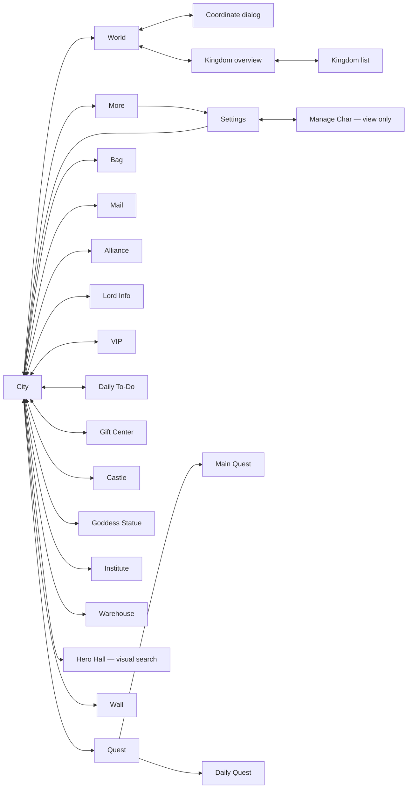

# Navigation reverse-engineering audit — September 10, 2026

**Decision: retain the project. Rebuild unproven navigation data in bounded pieces, especially city-atlas assumptions; do not restart the transport, observation, execution, storage, or workflow infrastructure.**

This is an evidence-backed partial map of the game, not a claim that every game screen or conditional transition is known. The three requested outcomes have different statuses: the rebuild decision is supported; a complete screen graph remains open; verified recognition and navigation gaps were repaired in the existing owners.

## Findings

1. **High — declared coverage substantially exceeds verified coverage.** The starting registry contained 212 selectors, including 70 template declarations with no corresponding PNGs and six collection declarations without template files. The starting model contained 102 screen states; 62 had neither recorded OCR frames nor discovery snapshots in the indexed sources. Nine visual profiles covered a small subset. OCR and geometry make many declared selectors work, but a declaration or `click_mapped` status is not proof of a current route. See [coverage](../artifacts/navigation_audit/index/coverage.md), [machine-readable evidence](../artifacts/navigation_audit/index/coverage.json), and [selector registry](../pnc_automation/app/pnc/vision/data/selector_registry.yaml). Clean direction: populate and prove one contract at a time, retaining explicit unknowns and missing assets.

2. **High — the Hero Hall atlas coordinate caused repeated wrong-location attempts.** The original city tour opened Castle, Goddess Statue, Institute and Warehouse, then exhausted its ten-step Hero Hall budget. Direct camera exploration found Hero Hall in the upper-left city area. The former `(1001, 1216)` coordinate has been removed from the canonical [building catalog](../pnc_automation/app/pnc/domain/building_catalog.py). The existing visual search subsequently found the Hero Hall label and opened the correct building; it also opened Wall. This fixes the demonstrated target without inventing another precise coordinate. Other atlas coordinates and fixed-view taps remain hypotheses until individually exercised. Evidence: `artifacts/navigation_audit/tours/20260910T205401Z_city/`, `20260910T210604Z_locate_hero/`, and `20260910T211556Z_city/`.

3. **Medium — world-to-city verification depended on absent portrait evidence. Fixed.** The actual transition returned to a visually confirmed city, but its contract required `PNC_HOME_CHARACTER_PANEL`, whose template was absent. The contract now requires the classified city plus the World switch and observed Quest/Bag controls. The negative regression still rejects the world map and a city observation with only geometry. Initial failure: `artifacts/navigation_audit/navigation/PNC_WORLD_HOME_NAV.yaml`. Live repair: `artifacts/navigation_audit/repaired/20260910T204134Z_testing_navigation_validation.yaml`.

4. **Medium — Gift Center existed in the enum and registry without an OCR screen-family implementation. Fixed.** A direct shortcut inspection reached Gift Center, but the old pipeline returned unknown. The canonical OCR enricher now recognizes its header, extracts large banner titles (including wrapped titles), excludes subtitle/expiry rows, and exposes a safe Back control. The shared grouped-row helper supports right-aligned titles for this layout while retaining its default for existing callers. The verified blue/gold shortcut crop is installed as the Gift Center template. Live proof: `artifacts/navigation_audit/repaired/PNC_HOME_RIGHT_RAIL_GIFT_CENTER_ICON_navigation_validation.yaml`. The old fixed-position Gift title/subtitle/expiry OCR crops were retired because they could match unrelated Home text. Titles now come from the canonical grouped banner parser; subtitle and expiry selectors remain explicitly unimplemented. This reads banner titles; it does not implement offer details, purchasing, claiming, or reliable timer/subtitle association.

5. **Medium — the animated Event Center shortcut remains unverified.** The original missing template prevented navigation. A candidate blue/gold icon was experimentally identified as Gift Center by its destination and assigned to that selector. The rotating featured-event candidate did not reliably match live and is retained only in `artifacts/navigation_audit/template_candidates/`. No candidate is installed as a working Event Center shortcut. The existing Event Center screen profile and archived screenshots remain useful once the screen is reached. The failed reports are preserved under `artifacts/navigation_audit/navigation/` and `repaired/`.

6. **Medium — the validator did not settle a loading frame already returned by executor-owned popup recovery. Fixed.** Concurrent popup-recovery changes caused the validator to receive Loading rather than the original popup. Its existing passive destination-settling helper is now used in that case. The regression verifies eventual arrival, not just a successful tap. Owner: [navigation selector validator](../pnc_automation/app/pnc/vision/navigation_selector_validator.py).

7. **High — the combined working tree is not test-clean.** The first full run passed 995 tests with 17 skips. The last full run tested 1,014 cases with four failures, five errors and 17 skips. The failures/errors concern shared popup/update recovery, preflight, canary identity navigation, resource reconciliation and runner end-to-end behavior. These areas were being edited concurrently and were preserved. The earlier cross-layer import failure was absent from this last run. See [final full-suite log](../artifacts/navigation_audit/unittest_handoff.log). Do not use the earlier green result to certify the final combined tree.

8. **Medium — the Goddess Statue nameplate was not a reliable hit target. Fixed for the observed layout.** A later panned-view retry repeatedly tapped its label without opening the building. The canonical building definition now supplies a vertical body offset; object recognition applies it and rejects points outside the safe city scene band. Other buildings retain their existing points. Deterministic checks cover both tested resolutions and rejection near the HUD. The bounded retry then opened Goddess Statue, Institute and Warehouse and returned City in 14 actions. Evidence: failed `artifacts/navigation_audit/tours/20260910T212050Z_city/` and passed `20260910T212555Z_city/`. This is a target-specific live correction, not universal calibration of all city layouts.

## Evidence method and limits

`tools/audit_navigation_evidence.py` inventories the evidence directories, reads every matching saved OCR record and discovery/validation report, and emits the enum/selector/contract matrix, city object catalog, OCR-family availability, missing-template list, explicit action-trace transitions, and file inventory. It does not infer edges from adjacent screenshot filenames. Historical predictions, authored outcomes, recorded transitions and human visual review remain distinct. Missing referenced discovery/validation images are explicitly flagged.

The final index contains 5,777 files with no parse errors. The index covers `artifacts/`, `archives/`, `selector_discovery_output/`, `navigation_selector_validation_output/`, `reviewed_plans/`, and `tests/data/`. Root-level city panoramas were also visually inspected. Indexing every file is not equivalent to visually reviewing every screenshot or replaying every historical image through today's OCR.

118 historical unknown frames were stratified across 29 artifact directories and visually triaged. The [triage manifest](../tests/data/navigation_audit/historical_triage.json) records labels, unsupported surfaces and source paths. These are triage labels, not automatically promoted runtime training references. The sample includes French layouts, disconnect/exit dialogs, loading screens, the BlueStacks storefront, tutorial overlays, Alliance Shop, Alliance Gift, Summon Saurgil, Enhance Gear and other content not represented by dedicated current states. The contact sheets are local audit artifacts; account SDK content is omitted from their reusable display.

The current `testing` BlueStacks display was already running. All live connections used the configured account, resolver and ADB paths through the canonical application runner. Active identity was observed without selecting another castle. No local account/castle configuration was intentionally edited. No recruitment, construction, research, resource use, purchases, reward claims, messages, dispatch or castle switch was requested by the probes.

The live tools use bounded observed actions and retain screenshots and traces. Existing runtime recovery remains part of those executions; these results are specific to this active castle and observed app layout.

## Observed screen connections and content

This diagram summarizes visited routes, including multi-step return flows; it is not a claim that every arrow is one direct tap. The generated JSON retains individual recorded transitions and artifact paths.

| Surface | Visually observed content | Remaining boundary |
|---|---|---|
| City | HUD, bottom navigation, building labels, shortcut rails, tutorial strip, queues | Animated shortcuts, alternative layouts and every atlas target are not fully validated |
| World | Coordinate bar, Home return, overview entry, world objects | A map-view proof is not a complete object survey or movement calibration |
| Coordinate dialog | K/X/Y fields, Go, Close | No cross-kingdom movement or resource action performed |
| Kingdom overview | Kingdom/ruler header, map, viewport marker, legend, visibility controls, kingdom-list entry | No exhaustive legend/toggle/marker combination proof |
| Kingdom list | Search field, kingdom groups and rows, ruler/alliance text, return | No kingdom selection or migration |
| Quest | Main/Daily tabs, tasks and rewards | Alliance Activity and every conditional task destination remain open |
| Bag | Item categories, resource rows, Use controls | No resource spending; not all categories and popups explored |
| Mail / Alliance | Hub/invitation or home surface and safe return | Membership- and role-dependent branches remain open |
| Institute | Research categories, queue and level locks | Unit Tactics and later branches require Institute levels 16–41 on the observed layout |
| Goddess Statue | Free-attempt display, resource wishes and locked gold | No wish was made |
| Warehouse | Protected resource values and Soulstone capacity | Upgrade and resource-detail transitions not exercised |
| Hero Hall | Recruitment surface after observed-label opening | No recruitment or exchange; atlas coordinate remains unset |
| Gift Center | Named banners, subtitles and expiry text in the image | Runtime parser reads banner titles only; detail screens and associations remain unverified |

## Changes delivered

- Canonical World→City and Home→Quest contracts, plus destination-settling repair.
- Gift Center OCR capability, banner-title extraction and one live-verified native-resolution selector template.
- Three additional guarded visual profiles: Institute, Goddess Statue and Warehouse, using six region-constrained anchors. The shared recognition catalog now has 12 profiles.
- Three reviewed reference screenshots added to the existing benchmark manifest. New profiles were checked at 540×960 and 900×1600 and must abstain when their description anchor is obscured. These three additions have no independent holdout yet.
- Goddess Statue uses a guarded body hit point derived from its observed nameplate.
- The disproved Hero Hall coordinate was retired; existing visible-object search and tapping remain canonical.
- Reproducible evidence audit tool, coverage/graph JSON and Markdown, historical visual triage, and deterministic regressions.
- Selector PNGs included in package data. The Gift Center shortcut PNG is validated at native 900×1600 only; unlike the screen profiles, the existing selector-template path does not normalize resolution.

## Validation record

| Command / proof | Result |
|---|---|
| Initial focused navigation command including nonexistent `tests.test_spatial_navigation` | Failed: wrong test-module name; 224 real tests passed |
| `py -m unittest tests.test_selectors tests.test_screen_classifier tests.test_flows_and_tasks tests.test_world_map_traversal tests.test_validate_visual_navigation` | Passed, 224 tests |
| `py tools/validate_visual_navigation.py --account testing --output-dir artifacts/navigation_audit/live` | Passed, seven actions; active identity and Quest tabs observed, returned City |
| `py -m unittest tests.test_navigation_selector_validator tests.test_selectors` | Passed, 18 tests after World→City repair |
| `py tools/validate_navigation_selectors.py --account testing --selector PNC_WORLD_HOME_NAV --output-dir artifacts/navigation_audit/repaired` | Passed, one live outcome |
| Canonical validator runs for Bag, Mail, Alliance, Lord Info, VIP, Daily To-Do | Passed; individual YAML reports in `artifacts/navigation_audit/navigation/` |
| Gift Center canonical validator after OCR/template repair | Passed; report in `artifacts/navigation_audit/repaired/` |
| `py artifacts/navigation_audit/final_menu_probe.py` | Passed: Gift Center and Quest contracts, one outcome each; returned City. Reports in `artifacts/navigation_audit/final_menus/` |
| Event Center shortcut attempts | Failed; missing/unstable candidate, no unverified Event template retained |
| Initial `py -m unittest discover -s tests` | Passed, 995 tests, 17 skips; `artifacts/navigation_audit/unittest.log` |
| Gift/vision/navigation combined regression during concurrent popup work | Failed, one popup-settling test; corrected in the validator and rerun successfully |
| `py -m unittest tests.test_gift_center tests.test_navigation_selector_validator tests.test_audit_navigation_evidence` | Passed after the integration repair; later additions covered by the focused final log |
| `py -m unittest tests.test_visual_screen_recognizer tests.test_template_matcher tests.test_benchmark_screen_recognition` | Passed, 22 tests before the added city-scale regression; `recognition_tests.log` |
| `py -m unittest tests.test_flows_and_tasks tests.test_visual_screen_recognizer` | Passed, 202 tests including city-scale/occlusion regression; `city_tests.log` |
| `py tools/benchmark_screen_recognition.py --output artifacts/navigation_audit/benchmark.json` | Passed, 21 frames, zero wrong actionable classifications; three new references are not independent holdouts |
| `py artifacts/navigation_audit/probe.py city` | Partial: four buildings confirmed; initial Hero Hall route failed |
| `py artifacts/navigation_audit/probe.py map` | Passed: coordinate dialog, overview, kingdom list and City return |
| `py artifacts/navigation_audit/probe.py locate_hero` / `calibrate_hero` | Camera observations captured; not promoted to calibrated coordinates |
| `py artifacts/navigation_audit/probe.py city hero_hall wall` | First visual-search budget failed; final run confirmed both Hero Hall and Wall and returned City |
| `py -m unittest tests.test_flows_and_tasks tests.test_gift_center tests.test_navigation_selector_validator tests.test_audit_navigation_evidence` | Passed, 207 tests in `focused_final.log` |
| Later `py -m unittest discover -s tests` | Failed, 1,011 tests, four failures, two errors, 17 skips; `unittest_final.log` |
| Final `py -m unittest discover -s tests` | Failed, 1,014 tests, four failures, five errors, 17 skips; `unittest_handoff.log` |
| `py -m unittest tests.test_city_label_taps tests.test_flows_and_tasks tests.test_gift_center` | Passed, 198 tests; `city_hitpoint_tests.log` |
| Final Gift/selector/discovery/audit offline checks | Passed, 26 tests; `gift_final_tests.log` |
| `py artifacts/navigation_audit/probe.py city goddess_statue institute warehouse` | Initial nameplate retry failed; corrected body-point retry passed all three and returned City |
| `py tools/audit_navigation_evidence.py` | Passed: 5,777 indexed files, no parsed-evidence errors |
| `git diff --check` | Passed; Git emitted line-ending notices |

## Remaining requirements before calling the map complete

The active castle has explicit level locks. A higher-level account/castle target was requested, but none has yet been named and authorized in this audit. An active-castle tour cannot prove inaccessible research, progression, alliance-role, seasonal-event or purchase-dependent screens. Resource-changing transitions require their own exact action/target/budget; no spending was necessary for this audit.

The remaining work is concrete: close the missing-screen/selector rows in `coverage.json`; review unsupported historical surfaces at full resolution; validate the Event entry; supply independent holdouts and other resolutions/localizations; validate each remaining atlas landmark; repair the combined popup regression failures; and visit the level-gated branches on an authorized target. Until then, **do not describe the graph as complete or the bot as ready for unattended general navigation**.
