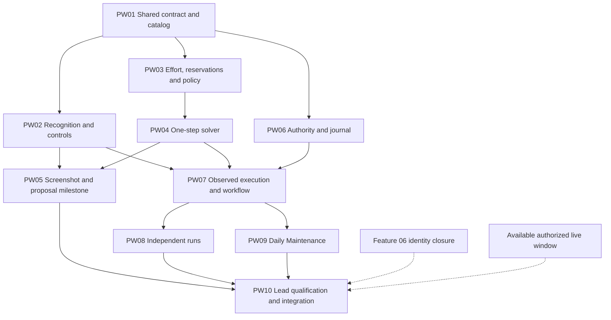

# Pet Workshop roadmap — separate delivery packets

Updated: 2026-09-16. **0/10 packets accepted; PW01 under independent review and combined validation. Next eligible wave after PW01 acceptance: PW02, PW03 and PW06.**

[Shared contract and recognition](PNC_PET_WORKSHOP_01_RECOGNITION_STATE_PLAN.md) · [Solver and policy](PNC_PET_WORKSHOP_02_SOLVER_POLICY_PLAN.md) · [Execution and integration](PNC_PET_WORKSHOP_03_EXECUTION_INTEGRATION_PLAN.md)

## Start here

This roadmap follows the organization used by the [OCR vision roadmap](PNC_VISION_ROADMAP.md): one entry point for dependencies, progress and assignments, with a separate Markdown file for each coherent packet. There are **nine implementation packets and one lead-owned qualification/integration packet**. The three design plans remain the canonical specifications; packet files own implementation steps, scoped proof and handoff. Do not copy the gameplay policy or shared interfaces into each packet.

Start with **PW01**, then use three independent lanes: **PW02 recognition**, **PW03 → PW04 solver**, and **PW06 authority/journal**. Once their consumed implementations are accepted, **PW05 screenshot/proposal review** and **PW07 observed workflow** can proceed alongside each other. PW08 independent runs and PW09 Daily Maintenance follow the accepted PW07 implementation. PW05 remains mandatory before any live gameplay; PW10 joins its acceptance, both entry points and the required live qualification.

Implementation was authorized on 2026-09-16. The lead coordinates the Devin implementation → independent review → fixes/offline checks → applicable live validation → merge/push → next eligible packet cycle below. Up to three independent Devin workers may run in isolated worktrees. The lead owns review, live resources, the progress table and integration.

The follow-up interview is resolved in the existing canonical owners: [level-linked order/producer evidence](PNC_PET_WORKSHOP_01_RECOGNITION_STATE_PLAN.md#workshop-progression-and-order-selection), [existing handling of blocked goals](PNC_PET_WORKSHOP_02_SOLVER_POLICY_PLAN.md#level-linked-progression-and-blocked-goals), and [two-way continuation with later-invocation isolation](PNC_PET_WORKSHOP_03_EXECUTION_INTEGRATION_PLAN.md#continuation-and-later-invocations). All packets follow Plan 01's architecture/documentation requirements. These clarifications add no dependency, service or live-validation phase.

### Current execution authority and acceptance gate

The implementation checkout was synchronized with `origin/main` at `0aab4d7f5a22dd89d85476c8359a05ab3981e28b` before dispatch. Recheck the remote at each integration; this checkpoint does not freeze subsequent accepted changes. The user authorizes merging and pushing accepted in-scope work without another confirmation.

The user's current instruction supersedes any earlier wording that would allow merging a live-observable packet with only offline acceptance. Validate distinct feature-owned use cases and relevant regressions using the actual final candidate before merging. A packet with no meaningful observable live effect needs no live check. Keep work requiring unavailable live proof awaiting validation, record the exact blocker and evidence under the packet's handoff, notify the user, and continue independent eligible work. PW10 still owns combined qualification; its ledger can collect relevant proof earlier rather than postpone a packet's required pre-merge check.

Live work is on hold: the configured castles on **3xx spies** are C1–C9, below Workshop’s C24 prerequisite, and the user is arranging a replacement account. Do not substitute another instance. Resolve the replacement through configured identity, roles and the canonical lease once supplied. Use the active castle unless switching is explicitly authorized. Preserve existing resource restrictions and bind any consumptive canary to the exact target/action/budget authorized by the request or approved plan; the lease alone does not invent a spending amount. No live work is needed for PW01. The existing native Devin completion callback and monitor own automatic handoff delivery; keep worker run/turn, reviewed/tested revisions and evidence in packet records. Do not treat worker completion as acceptance.

Use the status table below as the single queue record. During implementation record **Delegated**, **Under review**, **Fixing findings**, **Awaiting validation**, **Accepted**, **Merged/pushed**, or **Blocked: exact reason**. Untouched packets remain Planned. Record failures with reproduction/command, candidate revision, observed result, artifact references and next action in the affected packet; generated logs stay under `.local-data/`.

## Canonical document ownership

| Document | Owns |
| --- | --- |
| This roadmap | Packet index, dependencies, current status, next assignment and common worker/review workflow. |
| [Plan 01](PNC_PET_WORKSHOP_01_RECOGNITION_STATE_PLAN.md) | Interview decisions, common architecture, sourced evidence, shared model/catalog contract and recognition requirements. |
| [Plan 02](PNC_PET_WORKSHOP_02_SOLVER_POLICY_PLAN.md) | Reward ranking, effort estimates, reservations, legal actions, decision order and scenario expectations. |
| [Plan 03](PNC_PET_WORKSHOP_03_EXECUTION_INTEGRATION_PLAN.md) | Runtime owners, authority/budget, durable receipts, lifecycle, direct/authored/Daily behavior and continuation results. |
| Individual packet | Assigned implementation scope, focused validation and detailed acceptance evidence. PW10 also owns the live qualification ledger. |

The implementation will create `docs/PET_WORKSHOP_DESIGN.md` and the sourced `docs/game-reference/workflows/pet-workshop.md` through PW01. Later workers update their owned sections in those same canonical documents. The plans describe intended work; those implementation documents describe the resulting code and established behavior.

## Packet index and progress

Status is maintained here. Keep detailed review findings, commands, supported coverage and acceptance evidence in the linked packet. The former IDs are a small reference map for earlier discussion; use PW IDs for future assignments.

| Packet | Former ID | Offline implementation dependency | Status | Accepted base / result and remaining condition |
| --- | --- | --- | --- | --- |
| [PW01 — Shared contract and catalog](pet_workshop_packets/PW01_SHARED_CONTRACT_CATALOG.md) | C0 | Current accepted repository base | Under review | Worker `f650050` reconciled with `origin/main` `7af5e89`; lead corrected unread-cell defaults and recycling fixture. 78 focused tests passed; combined portable validation pending. |
| [PW02 — Recognition and controls](pet_workshop_packets/PW02_RECOGNITION_CONTROLS.md) | R1 | PW01 | Planned | Saved captures available; missing action-state coverage remains explicit. |
| [PW03 — Effort, reservations and policy](pet_workshop_packets/PW03_EFFORT_RESERVATIONS_POLICY.md) | S1 | PW01 | Planned | Offline solver lane; independent of PW02. |
| [PW04 — One-step solver](pet_workshop_packets/PW04_ONE_STEP_SOLVER.md) | S2 | PW03 policy implementation | Planned | Same worker may continue from tested PW03 code and hand both back together; a separate worker receives an accepted dependency commit. |
| [PW05 — Screenshot/proposal milestone](pet_workshop_packets/PW05_SCREENSHOT_PROPOSAL_MILESTONE.md) | R2 | PW02 + PW04 | Planned | Lead must review actual labels and decisions, including three-coconut rejection. |
| [PW06 — Authority and journal](pet_workshop_packets/PW06_AUTHORITY_JOURNAL.md) | X1 authority/persistence | PW01 | Planned | Third independent lane; no parser, solver or screenshot-tool dependency. |
| [PW07 — Observed execution and workflow](pet_workshop_packets/PW07_WORKFLOW_EXECUTION.md) | X2a + X1 action session | PW02 + PW04 + PW06 | Planned | Consumes actual controls/route evidence, planner/validator and durable boundary. Independent of PW05 reports and live availability. |
| [PW08 — Independent runs](pet_workshop_packets/PW08_INDEPENDENT_RUNS.md) | X2b | PW07 | Planned | CLI, direct API and authored-task binding; independent of PW09. |
| [PW09 — Daily Maintenance](pet_workshop_packets/PW09_DAILY_MAINTENANCE.md) | X2c | PW07 | Planned | Connected Daily adapter; independent of PW08. |
| [PW10 — Qualification and integration](pet_workshop_packets/PW10_LIVE_QUALIFICATION_INTEGRATION.md) | X3 | PW05 + PW08 + PW09 for combined acceptance | Planned | Lead can review available offline handoffs earlier. Live phase additionally needs Feature 06 identity closure and an authorized window; missing transitions remain pending. |

The former **S3** was the solver lead-review/handoff gate. It is retained in the common review workflow and PW04 → PW05 acceptance, without inventing an extra implementation assignment.

## Delivery waves and parallel work

Solid arrows are code or combined-acceptance dependencies. Dotted arrows are prerequisites for the lead's live phase, not barriers to offline coding.

1. **Foundation:** PW01 establishes the shared types/catalog and pure interface signatures. Publish one accepted implementation commit for the three consumers. It does not implement the future parser, solver or executor and requires no production stubs.
2. **Three offline lanes:** PW02 owns visual facts/controls; PW03/PW04 own the pure policy/planner; PW06 owns authority and persistence. PW06 uses the existing dispatch/reconcile callback boundary and supplied typed outcomes. It does not inspect pixels, choose actions or interpret game transitions.
3. **Two useful joins:** PW05 joins recognition and planning for reviewed saved-image output. PW07 joins those implementations with PW06 for the action session and workflow. Neither joins through the other. PW07 can be implemented and tested offline while PW05 reports are reviewed; it cannot be invoked on a live game ahead of the milestone.
4. **Entry points:** PW08 and PW09 consume the same accepted PW07 implementation/result contract. They are independent of each other and of live-window availability. Keep target sequencing and instance-stop policy in PW07, scope construction in PW06, and adapters thin. A missing common function returns to its owner instead of creating a private replacement.
5. **Live qualification:** after PW05 is accepted, the lead may run the scoped PW10 canaries when identity, target, lease, actions and budget are established. PW10's actual transition proofs then determine unattended promotion; they cannot be required before the very canaries that collect them. Combined offline review can proceed while an external live prerequisite is unavailable.

Prefer one persistent worker per useful lane; no extra worker or packet is needed for the moved action-session scope. PW07 owns the cohesive action-session/workflow slice while preserving focused components in code. Workers may be appropriately authorized Devin coding workers or Luna xhigh agents. The lead owns uncertain shared-interface decisions, cross-packet review, small follow-up corrections and final integration. This organization does not import the other task's worker count, live targets or delivery authorization.

### Dependency review — 2026-09-16

**Implementation-ready after the corrections below.** All ten packets remain planned; this review does not establish live promotion readiness.

| Finding and correction | Repository basis |
| --- | --- |
| Removed the unnecessary PW05 → PW06 barrier. Authority/journal work can finish independently from screenshot and solver work; move operation-specific gesture/receipt interpretation into PW07. | [JournaledMutationDispatcher](../pnc_automation/app/automation/daily_maintenance/mutation_dispatcher.py) already accepts dispatch/reconcile callbacks; [its offline tests](../tests/unit/app/automation/daily_maintenance/test_daily_mutation_dispatcher.py) use a temporary journal and supplied outcomes. |
| Made the true PW07 dependencies explicit: PW02 controls/route evidence, PW04 planner/validator and PW06 authority/store. Keep PW05 as a pre-live acceptance condition instead of a coding prerequisite. | [WorkflowContext/CoreWorkflowRunner](../pnc_automation/app/automation/engine/core_workflow.py) compose runtime observation and mutation authority; [workflow tests](../tests/contract/workflows/test_core_workflow.py) supply a fake runtime without emulator access. |
| Keep PW08/PW09 independent and remove hidden reverse dependencies. PW06 accepts explicit typed scope/policy inputs; PW07 owns the connected workflow and shared continuation results. Neither depends on adapter configuration or TaskId registration. | [CoreMutationBoundary](../pnc_automation/app/automation/engine/core_daily_mutation.py) already receives typed target/boundary values; [DailyCastleRunner](../pnc_automation/app/automation/daily_maintenance/application_service.py) provides the existing connected composition seam. |

The longest planned packet chain decreases from eight to six packets. This is a dependency-count change, not a runtime or delivery-time estimate. The remaining dependencies are actual consumed behavior: shared types/catalog, legal-action/effort functions, measured observations, durable authority, or the canonical workflow. Do not add stub services, speculative interfaces or duplicated policy merely to draw fewer arrows.

## Worker dispatch

Before dispatch, read the repository instructions and applicable implementation/source-control skills, confirm task-owned checkout and consumed dependency commits, and reconcile newer landed work. Cross-worker handoffs require an accepted dependency commit. PW03/PW04 may stay with one worker: continue from tested policy code, then return a combined diff for lead review before any other worker consumes it. This removes an internal dispatch/approval pause without deleting their real code dependency. The planning baseline in Plan 01 is evidence, not a fixed implementation base.

Use this brief with the actual packet path, worker choice, base and owned checkout filled in:

> Implement **PWxx** from `reviewed_plans/pet_workshop_packets/<packet>.md`, following its linked canonical design sections and `reviewed_plans/PNC_PET_WORKSHOP_ROADMAP.md`. Use the assigned task-owned checkout at the recorded accepted dependency commit. Own only this packet's symbols, profiles, selectors, callers and documentation sections. Reuse the accepted shared models, parser, policy, runtime and journal; return a missing shared interface to its owner. Complete the scoped implementation and smallest relevant offline checks, then return the actual diff, command results and evidence for lead review. Keep unsupported evidence states explicit. Use no live emulator access unless the lead supplies the applicable authorized scoped phase. Commit/push only under the implementation task's delivery instructions.

The read-only `devin-game-knowledge` consultation workflow is not a coding worker. Do not repurpose it by escalating its permissions. Resolve the currently available coding workflow at dispatch; this plan does not prescribe a guessed CLI or start a background process.

Use one task-owned worktree per concurrently active worker. Partition shared files by symbols/profile/selector keys, not whole-file reservations. Avoid competing edits to the same concept. If a shared contract must change, its owner makes the canonical change, migrates affected callers and supplies the new accepted dependency to consumers.

## Worker handoff and lead review

Each handoff includes:

- Packet ID, dependency/base revision, result revision if committed, and task-owned residual edits.
- Changed paths and owned symbols/sections, with the actual diff available for review.
- Passed, failed and skipped commands, plus relevant fixture/report/artifact paths.
- Supported behavior and material uncertainty, including exact live observations still pending.

The lead reviews actual code, decisions and caller paths, resolves substantive findings, and runs only the affected checks after corrections. Worker completion is not acceptance. In particular, the former S3 solver review requires explainable actual decisions and estimate limitations before passing the public planner to PW05 or execution; policy must not migrate into the live runner to unblock integration.

Record detailed acceptance under the packet: reviewed revision, supported scope, meaningful command outcomes, evidence and remaining conditions. Update the corresponding row here with that revision and disposition. Reconcile shared implementation-document edits when combining PW02/PW03 or PW08/PW09. Once consumed dependencies are accepted and present on the next worker's base, assign the earliest useful ready packet within the authorized implementation scope. Do not wait for unrelated packet work or live qualification. The same-worker PW03/PW04 sequence can use one reviewed handoff; record the disposition for both packets.

For a blocked packet, record its exact missing dependency, interface or observation. Continue independent ready work. Repeatedly polling an unchanged state or retrying the same failed live action is not progress.

## Validation and acceptance

Use these statuses: **Planned**, **In progress**, **Offline ready**, **Accepted for stated coverage**, **Integrated**, or **Blocked: exact prerequisite**. They describe delivery evidence, not a claim that every underlying repository capability is new. Record partial recognition coverage explicitly; it does not waive PW10's full release requirements.

- **Contract ready for handoff:** consumed interfaces and implementations are reviewed, checked and present in a recorded accepted dependency commit. Same-worker PW03/PW04 development may precede that external handoff; another worker cannot consume unreviewed shared code. No substitute runtime models or stubs.
- **Offline ready:** packet-specific checks pass through the intended production owners; real saved images prove recognition where applicable, and typed synthetic scenarios prove decision/receipt behavior. Synthetic evidence is labeled as such.
- **Accepted for stated coverage:** the lead reviews the actual diff, canonical ownership, caller integration and meaningful tests. Required live proof for the claimed coverage is complete, or the acceptance explicitly remains offline with the missing live coverage assigned to PW10.
- **Integrated:** the accepted implementation and its dependencies are combined and required combined checks pass. Commit/push follows the current task's delivery authorization.
- **Full feature accepted:** PW10's material live transitions and stop boundary are qualified, the Feature 06 identity preflight is closed, and independent/authored/Daily entry points use the canonical behavior. Do not count an offline handoff as this final gate.

Use `py tools/run_tests.py` for focused groups/specific tests, then `py tools/run_tests.py affected --base <accepted-base> --explain` for ordinary source changes. Accept a legitimate full fallback; shared model/schema/authority changes and final combined integration justify `py tools/run_tests.py full`. Do not repeat broad suites for every packet once adequate evidence exists. Documentation-only changes need relevant link/config validation and `git diff --check`, without unit or live tests.

PW02 supplies the reviewed evidence for source controls and destination identities for navigation edges. PW10 owns current production-route and action qualification through the canonical lease/workflow, using the applicable live skills and scoped action/target/budget. A screenshot alone, remembered coordinates or an agent's visual identity assertion do not qualify an unattended route. The existing [Feature 06 regression](PNC_CORE_REMAINING_06_CASTLE_NAVIGATION_PLAN.md#september-16-regression-native-screenshot-drops-the-selected-hopium-row) stays with its owner.

## Completion

Completion requires all ten packet dispositions to be supported by their actual evidence and the [Plan 03 definition of done](PNC_PET_WORKSHOP_03_EXECUTION_INTEGRATION_PLAN.md#6-tests-and-completion). Report remaining conditions and source-control state accurately. A missing required live state remains pending; do not silently reduce the agreed four-mechanic scope or treat positive-energy blockage as observed zero.
