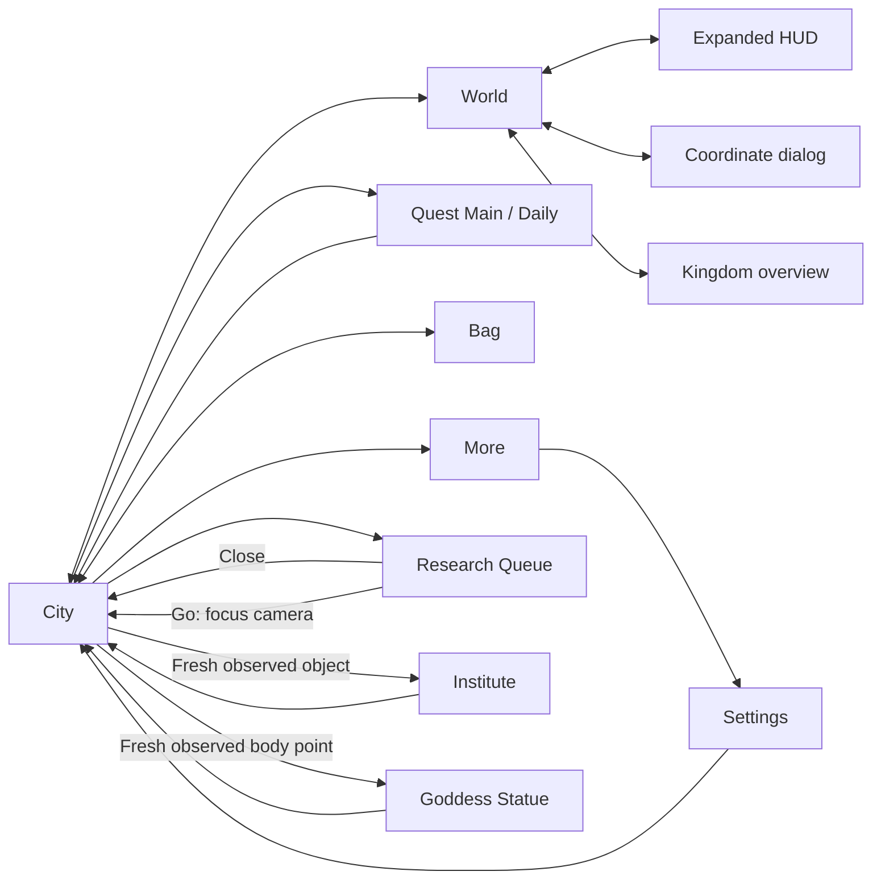

# Replacement navigation core — implementation record

Branch: `codex/pnc-replacement-core`. Isolated worktree: `C:/Users/lebel/pnc/artifacts/replacement_core/worktree`. Another task changed the shared checkout to a YOLO branch during this work, so the existing branch was checked out in an isolated worktree and the baseline plus core files were preserved there. Created from the existing checkout with pre-existing working-tree changes preserved. This record describes the replacement-core changes, not ownership of the entire working tree.

## Architecture decision

Follow-up: [game-first transition additions](PNC_GAME_FIRST_TRANSITIONS.md) records new routes discovered directly from the running game after this initial implementation, including context-dependent return behavior. Its verification is separate from the initial evidence below.

Keep the Python, ADB/BlueStacks, capture, matching, typed domain and storage stack. Replace navigation orchestration incrementally. The demonstrated failures concern unverified coordinates, ambiguous screen ownership, unreliable hit targets and overlapping completion/recovery behavior; they do not establish that the language or emulator transport is unusable. The new core has driven the same infrastructure through 24 confirmed transitions across 13 distinct screens. A complete project restart is not justified by this evidence.

The earlier audit indexed 5,777 artifact files and identified significant declared-but-unverified coverage. That index and its historical screen/content map remain useful in `PNC_NAVIGATION_AUDIT.md`; they are not certification of the new core. Its older test status is superseded by the isolated checks below.

## Implemented architecture

The opt-in core reuses the configured BlueStacks session, screenshot storage, image matcher, domain models and device actuator. It runs independently of the legacy observation-builder/classifier/flow/retry loop. Unsupported states do not fall back to that loop during a core transition.

Live accessibility reconnaissance found six Android nodes, zero text nodes and zero clickable nodes on the active city screen. That inspected hierarchy did not expose usable game controls, so this implementation uses image evidence.

| Responsibility | Core behavior |
|---|---|
| Screen identity | Global visual profiles, independent of the requested destination or OCR content family |
| Overlay ownership | Explicit containment; More can own the still-visible City/World background; unrelated conflicting matches abstain |
| Control targeting | A current-frame template match; inferred registry geometry cannot authorize navigation |
| Modal ownership | A recognized dialog owns its measured Close control; update/disconnect text guards still run independently |
| Content | Optional parsing after identity; contradictions fail, and parsed content cannot create navigation controls |
| City objects | Unique observed object and current tap point; no atlas, remembered camera position, or blind scanning |
| Routing | Reviewed non-spending graph, replanned after each confirmed transition |
| Completion | One action, bounded passive observations, two consecutive fresh destination captures |
| Failure | Recorded evidence and stop; no repeated tap or automatic popup recovery |

There is one completion implementation for template controls and observed city objects. The visual catalog and matcher are extended in place rather than copied. Existing content and global interruption parsers remain shared during migration.

## Files

- `pnc_automation/app/automation/engine/navigation_core.py`: typed graph, routing, completion and observed building entry.
- `pnc_automation/app/pnc/vision/navigation_perception.py`: independent identity, guard and optional content extraction.
- `pnc_automation/app/pnc/vision/visual_screen_recognizer.py`, `data/screen_anchors.json` and PNGs: measured controls, modal/overlay ownership and six additional screen profiles, bringing the catalog to 18.
- `pnc_automation/app/pnc/vision/pnc_observation_enricher.py`: separate interruption API using existing popup/loading parsers.
- Screen/selector enums and `selector_registry.yaml`: expanded-world and Research Queue states, a distinct HUD toggle, and Queue Go/Close with explicit outcomes.
- `tools/validate_visual_navigation.py`: opt-in `--replacement-core` proof using the configured runtime.
- `tests/test_navigation_core.py` and `tests/data/screen_recognition/`: targeting, transition, modal, content and animation regressions; asset provenance in `replacement_core_provenance.json`.

## Live-derived corrections

1. An initial city anchor included the animated Z above Build. The first attempt stopped before tapping. It now uses the stable Build label, and the failed frame is a regression fixture.
2. A legacy upgrade-warning color heuristic misidentified the coordinate dialog. This workflow-specific heuristic is not used as a general core guard.
3. The coordinate dialog's own gold X triggered generic popup detection. Measured modal ownership now resolves that case while preserving independent update-text detection; an offline regression checks both behaviors.
4. An initial control crop confused the four-arrow HUD toggle with the separate kingdom-overview entry. The failed live frame supplied the expanded-world state and its return control. The overview crop was corrected. The core subsequently proved Expanded World to World to City.
5. Home Quest text was detected correctly but tapping the label was a no-op. The control assets now match the Quest, Bag and More icons inside their button hit areas.
6. The old identity probe's allowlist lacked the known dialog/overview Close and World Home controls. Those non-spending return controls were added.
7. Research opens the idle Research Queue. Its Go button focuses Institute in City; it does not open Institute. `open_building(INSTITUTE)` now follows that observed route, reacquires typed city objects, and opens the measured Institute target. Ordinary return from Queue uses Close. A regression rejects treating Go as successful building entry.
8. The Research label sits on a translucent background, and the adjacent book animates. A panned city frame exposed the rectangular crop's dependence on scenery. Its PNG now masks the background using the existing alpha-aware matcher. The failure-derived fixture and subsequent live Queue→Close proof pass without lowering the threshold.
9. A real disconnect appeared after the map/menu route. The core stopped before sending the next action. A separate existing bootstrap recovery reconnected the app, after which bounded building proofs resumed. Automatic reconnect is not part of the new core.

Failed attempts remain under `C:/Users/lebel/pnc/artifacts/replacement_core/`; they are not successful route evidence.

## Verification

```powershell
py tools/validate_visual_navigation.py --replacement-core --config C:/Users/lebel/pnc/config/accounts.yaml --account testing --output-dir C:/Users/lebel/pnc/artifacts/replacement_core/isolated_live
```

The core first returns from a supported starting map/modal to City. The retained legacy identity preflight then inspects the active castle without selecting another one. All subsequent core captures and transitions use independent perception and completion. No purchases, reward claims, resource use, research start, recruitment, dispatch, messages or castle switching are included.

- Focused navigation/recognizer/probe/selector/discovery checks: passed, 49 tests, `artifacts/replacement_core/focused.log`.
- Earlier recognition checks exposed three More/root overlap failures, corrected with explicit containment.
- An intermediate full run failed with 62 catalog-load errors because the HUD-toggle declaration omitted reviewed outcomes. The declaration was corrected and focused checks passed. This was an integration error in the replacement work.
- `py -m unittest discover -s tests`: passed, 1,041 tests, 17 skips (`artifacts/replacement_core/unittest_final.log`).
- Isolated-worktree `py -m unittest discover -s tests`: passed, 1,031 tests, 18 skips (`C:/Users/lebel/pnc/artifacts/replacement_core/isolated_unittest.log`). The isolated copy excludes the concurrent YOLO tests and private local fixture configuration.
- Final isolated `py -m unittest discover -s tests`: passed, 1,032 tests, 18 skips (`C:/Users/lebel/pnc/artifacts/replacement_core/isolated_final_unittest.log`). This precedes the final masked Research asset and its new panned-frame regression.
- Final `py -m unittest tests.test_navigation_core tests.test_visual_screen_recognizer tests.test_template_matcher`: passed, 36 tests (`C:/Users/lebel/pnc/artifacts/replacement_core/final_targeted.log`), including that last asset change.
- Live map/menu tour above: 16 confirmed transitions across ten states, then **failed/stopped on an actual disconnect** before the building action. Evidence: `C:/Users/lebel/pnc/artifacts/replacement_core/isolated_live/20260910T222531Z_core_840f06da/summary.json` and `trace.jsonl`. This is not a clean end-to-end pass.
- `py C:/Users/lebel/pnc/artifacts/replacement_core/prove_buildings.py`: passed, six confirmed transitions covering Research Queue, in-game Institute focus, observed Institute entry, observed Goddess Statue entry and City returns. Evidence: `C:/Users/lebel/pnc/artifacts/replacement_core/city_20260910T224355Z/`.
- `py C:/Users/lebel/pnc/artifacts/replacement_core/prove_queue_close.py`: passed, two confirmed transitions after the final Research asset change; the trace explicitly records `PNC_RESEARCH_QUEUE_CLOSE`. Evidence: `C:/Users/lebel/pnc/artifacts/replacement_core/queue_close_20260910T225359Z/`.
- `py C:/Users/lebel/pnc/artifacts/replacement_core/validate_legacy_boundary.py`: passed, one selector, zero failures/skips. This invokes the existing `tools/validate_navigation_selectors.py` validator for `PNC_WORLD_HOME_NAV`; evidence is `C:/Users/lebel/pnc/artifacts/replacement_core/legacy_boundary_navigation_validation.yaml`. An initial harness import failure was corrected by adding the tool bootstrap directory; no device action occurred in that failed import.
- No protected account/castle configuration was edited. BlueStacks was returned to City. Changes are uncommitted because this worktree includes preserved pre-existing work.
- `git -c core.safecrlf=false diff --check`: passed in the isolated feature worktree.

The three core traces contain 24 confirmed transitions and 13 unique destination screens. The trace-derived inventory is `C:/Users/lebel/pnc/artifacts/replacement_core/final_evidence.json`. The navigation-only core consumes measured controls; existing typed OCR/content parsers are invoked only when content is required, after screen identity. This does not populate or validate every content field in the game.



Arrows represent the bounded core routes above. Quest tab switching was also observed; the graph does not imply all menus or conditional states are mapped.

## Migration boundary

This is a bounded replacement navigation core, not a completed rewrite of all bot workflows or a complete map of the game. It is opt-in; the default daily-maintenance runner remains unchanged by the core migration.

The live-proven graph covers City, World, expanded World, coordinate dialog, kingdom overview, Quest Main/Daily, Bag, More, Settings, Research Queue, Institute and Goddess Statue. Warehouse and Hero Hall return edges are retained from prior reviewed navigation but were not exercised by this replacement-core proof. Observed city-object entry requires a recognized destination and reviewed return route. Invisible or ambiguous buildings produce a no-action failure; Institute has the specific in-game focus route described above. Measured camera search/localization, broader screens, busy research queues, other languages/layouts, spending workflows and interruption-recovery policies remain outside this first core.

Same-session captures are correlated. New reference images and failure-derived regression frames are not independent holdouts. Small live tours do not establish unattended reliability. The global OCR guard is retained, so this implementation is not claimed to solve perception latency yet.
